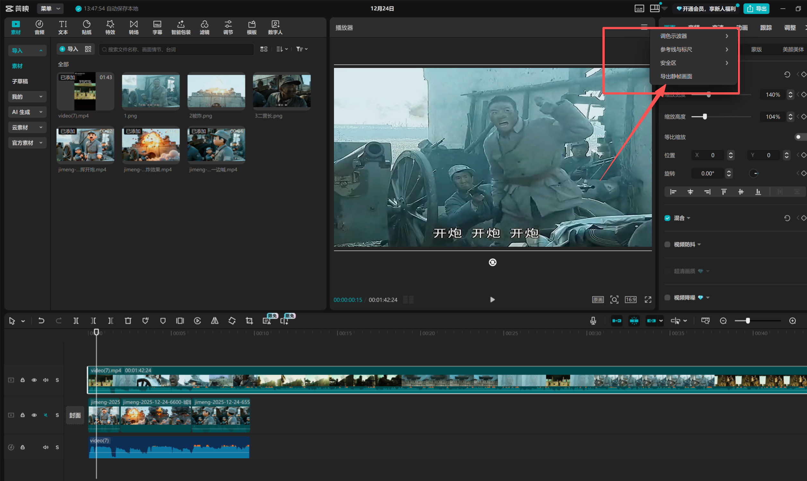
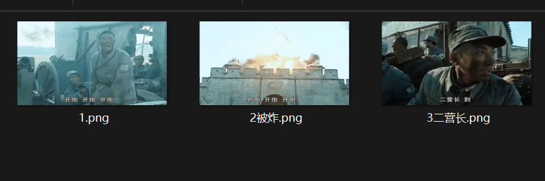
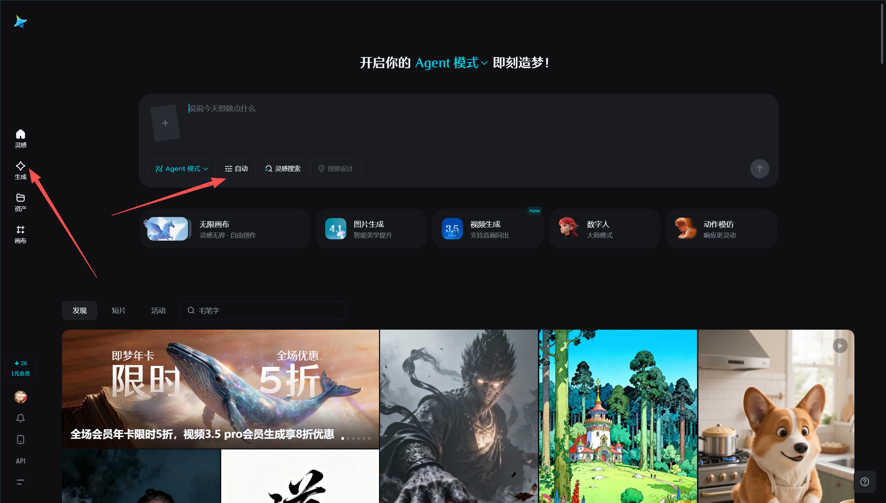
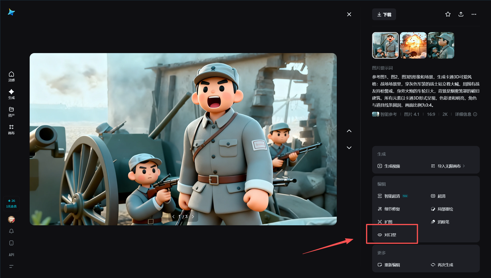
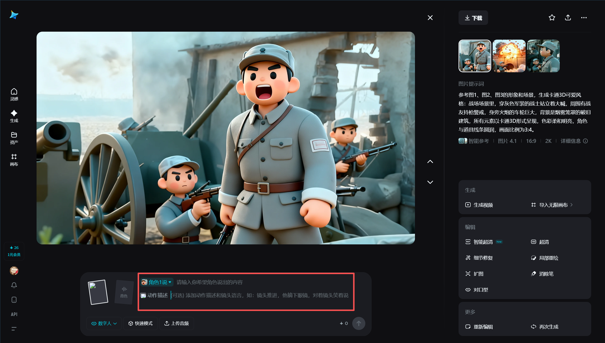
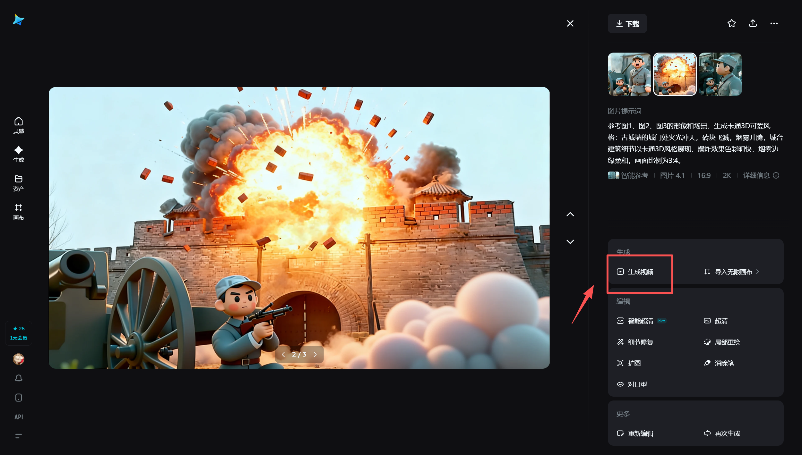
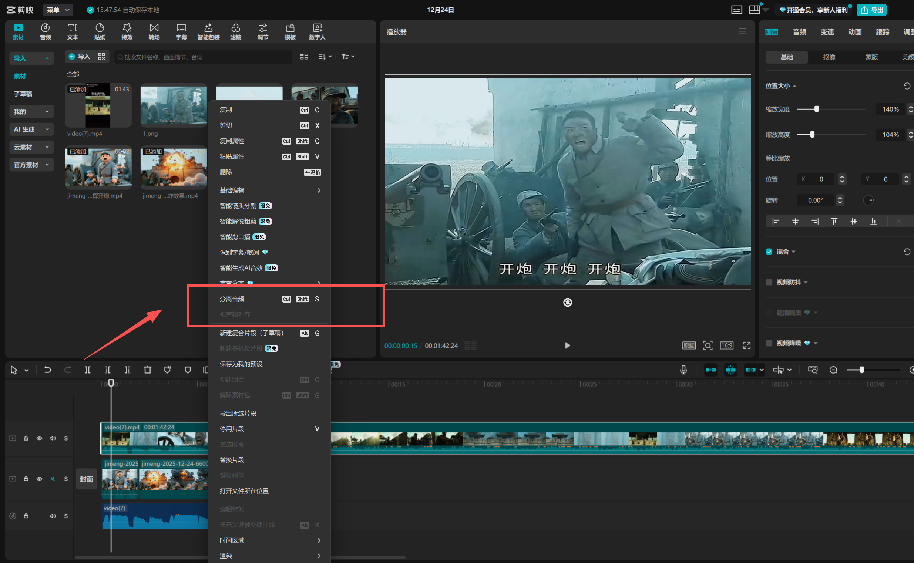
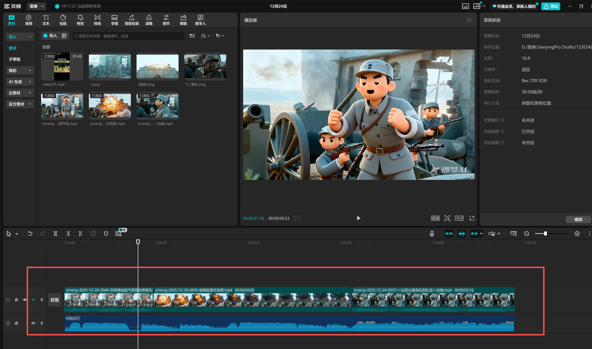

# 整体流程
1、在剪映中根据每个阶段/转场点导出静帧画面（或者直接截图也行，反正目的是要照片） 
2、在即梦中生成图片，输入提示词（根据实际需求描述） 
3、获得图片后，选择对应的图片进行对口型（可提供切换角色来实现多角色对口型） 
4、如果需要生成的是过场场景，这里建议使用生成视频功能  
5、处理好所有素材后，将处理完的所有素材导入视频剪辑软件，然后根据素材添加合适的音频、音效、旁白即可生成想要的效果！（即梦只是处理AI动漫化和短暂的动作口型效果，时长越长，要处理的图片素材就越多，处理完成后需要自己手动拼接合成最终视频）

# 操作步骤
## 一、剪映导出静帧画面
根据实际需求导出静帧画面

## 二、即梦生成3D动画
这里以这三张为例

选择图片生成、模型4.0(也可以选更高的)、图片比例、清晰度 
输入以下提示词(参考)：请保持人物衣服颜色，场景不变，帮我生成卡通3D 可爱风格，如果没有人物就生成背景风景即可。

## 三、素材处理
动漫图片生成后进行处理
1、有人物的图片选择“对口型”

输入角色台词、动作描述、音色（这个可以随便选，后期合成视频使用原声）

2、只有风景/背景的过场图片选择“生成视频”，输入结合图片想要实现的场景效果

## 四、视频剪辑合成
每张图片素材处理好后，开始合成视频 
如果要使用源音频就先分离音频，然后将处理好的素材和源音频裁剪匹配合成

<video src="photos/video.mp4" controls height="400"></video>
