# Tomcat常见安全配置

## HTTP慢攻击防御
>http慢攻击常用防御参数<br>
maxHttpHeaderSize 请求头限制<br>
maxPostSize       POST请求数据最大限制<br>
connectionTimeout 最大连接时间（针对http慢攻击）<br>
maxParameterCount 最大并发连接数<br>

在server.xml的Connector中添加

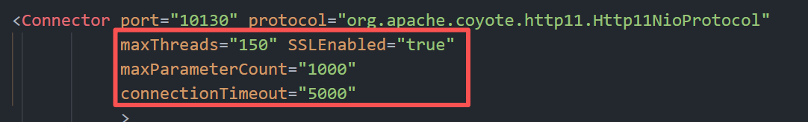

## 开启HTTP/2.0连接
**Tomcat 启用 HTTP/2.0 的升级协议配置：**
1. 作用是让 Tomcat 在 HTTP/1.1 连接器基础上，支持「协议升级」—— 客户端（如现代浏览器）发起请求时，会先通过 HTTP/1.1 的Upgrade头协商升级到 HTTP/2.0；
2. 因为配置了SSLEnabled="true"（HTTPS），HTTP/2.0 会以h2协议（加密的 HTTP/2）提供服务（浏览器仅支持加密的 HTTP/2，明文 h2c 基本不用）；
3. 若没有这个配置，Tomcat 仅支持 HTTP/1.1。
```xml
<UpgradeProtocol className="org.apache.coyote.http2.Http2Protocol" />
```

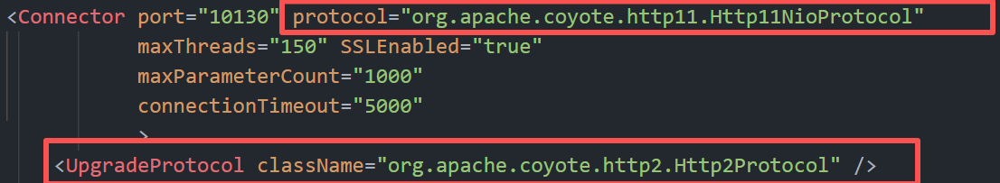

***<big>Tomcat Connector 的 protocol 属性主要有以下几种选项，各自对应不同的 I/O 模型和实现方式：</big><br>***

**HTTP/1.1**
- 在 Tomcat 8 中，默认通常会选用 NIO 模型（即“org.apache.coyote.http11.Http11NioProtocol”）来处理请求。
- 这种方式简化了配置，但如果需要精细控制，建议直接指定具体的实现类。

**org.apache.coyote.http11.Http11Protocol**
- 这是基于传统阻塞 I/O（BIO）的实现。
- 每个 TCP 连接都会由一个独立的线程进行处理，线程阻塞直到请求完成。
- BIO 模型实现简单，但在高并发环境下，由于线程数受限，扩展性较差。

**org.apache.coyote.http11.Http11NioProtocol**
- 这是基于 Java NIO（Non-blocking I/O）的实现。
- 利用 Selector 和非阻塞 SocketChannel，可以用较少的线程管理大量并发连接。
- Tomcat 8（以及8.5）的默认 Connector 就是采用这种模式，它能更好地支持高并发请求。

**org.apache.coyote.http11.Http11Nio2Protocol**
- 这是基于 Java NIO.2（引入于 Java 7）的异步 I/O 实现。
- 相对于传统 NIO，它使用 AsynchronousSocketChannel 和回调机制，可以在某些场景下进一步提高扩展性和资源利用率。
- 使用 NIO2 需要 JDK 7 及以上，并且在实际性能表现上会受到底层操作系统异步 I/O 支持的影响。

**org.apache.coyote.http11.Http11AprProtocol**
- 这是基于 APR（Apache Portable Runtime）及其 native 库实现的 Connector。
- 通过调用本地 C 库（以及 OpenSSL 等）来优化 I/O 操作和 SSL 加解密，通常能提供更高的性能和更低的延迟，特别适合高并发场景。
- 启用 APR 模式需要预先安装并配置相应的本地库（如 apr、apr-util 及 tomcat-native），在 Windows 平台下其默认连接数也会受到一些特定调整。

## 开启HTTPS连接
将https连接注释取消，修改对应端口，如果不需要http连接的话，可以把http连接字段注释.这样就无法使用http访问了<br>
- ***测试环境使用keytool生成自签证书***
```
"%JAVA_HOME%\bin\keytool" -genkeypair -alias tomcat -keyalg RSA -keysize 2048 -validity 365 -keystore conf/localhost-rsa.jks -storepass changeit -keypass changeit -dname "CN=localhost, OU=Test, O=Test, L=Beijing, ST=Beijing, C=CN"
```
|参数|作用|关键说明|
|:--|:--|:--|
|"%JAVA_HOME%\bin\keytool"|调用 JDK 自带的keytool证书管理工具|%JAVA_HOME%是你的 JDK 安装目录（需提前配置环境变量），Windows 下用双引号包裹路径（避免空格报错），Linux/Mac 无需双引号
|-genkeypair|核心指令：生成「密钥对」（公钥 + 私钥）+ 自签名证书|没有指定 CA 签名，生成的是自签名证书（仅适合测试 / 本地环境，生产需用 CA 签发的证书）|
|-alias tomcat|设置证书在「密钥库」中的别名|Tomcat 默认会查找alias=tomcat的证书，这个配置是为了适配 Tomcat 默认逻辑，后续在 server.xml 中无需额外指定 alias，直接用即可|
|-keyalg RSA|指定生成密钥对的加密算法为 RSA|RSA 是 HTTPS/Tomcat 最常用的非对称加密算法（通用、安全、性能均衡），替代了老旧的 DSA 算法|
|-keysize 2048|	指定 RSA 密钥长度为 2048 位|安全合规的最低标准：1024 位已被破解，4096 位更安全但性能稍低，测试 / 生产都推荐 2048 位|
|-validity 365|指定证书有效期为 365 天（1 年）|超过有效期后 HTTPS 访问会提示 “证书过期”；生产环境可设更长（如 3650 天 = 10 年），测试环境 1 年足够|
- ***配置HTTPS证书（如果是pem格式的需要先转换成pc12格式的）***
```xml
<Certificate certificateKeystoreFile="conf/localhost-rsa.jks"
             certificateKeystorePassword="changeit" type="RSA" />
```

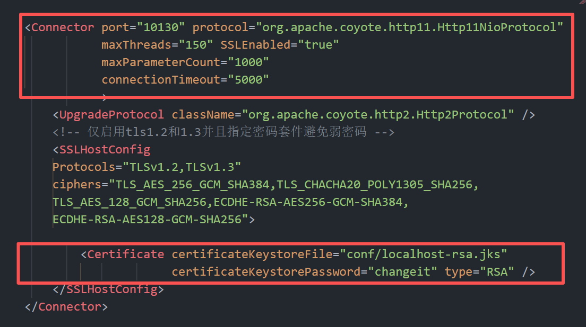

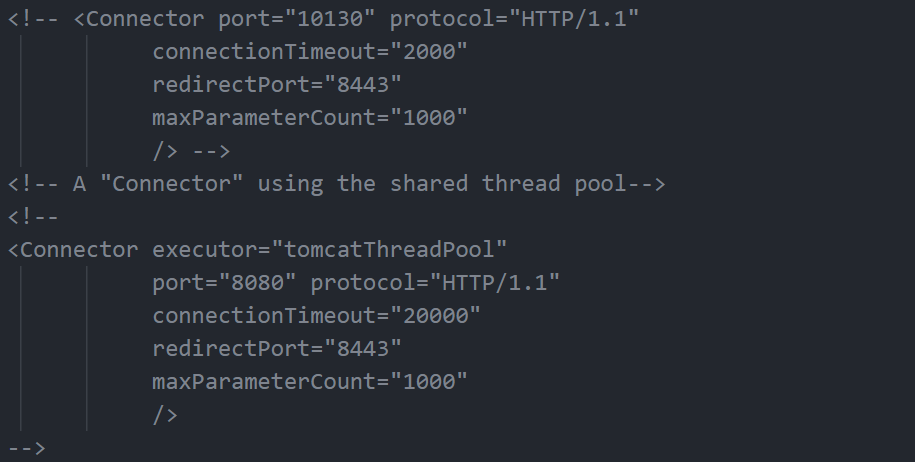

- 使用http连接会提示“This combination of host and port requires TLS.”

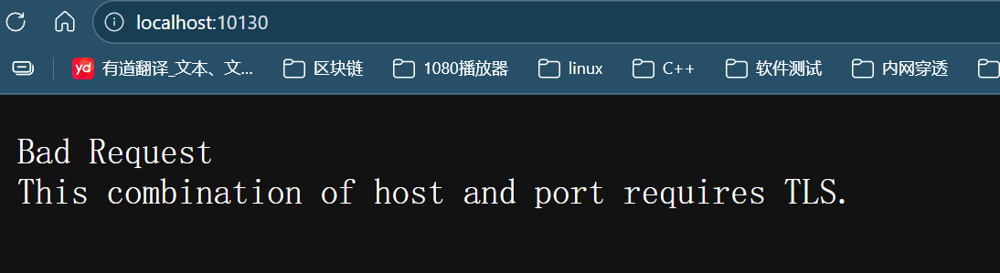

## HSTS配置
在web.xml底部web-app标签内添加filter标签内容
```xml
<filter>
    <filter-name>httpHeaderSecurity</filter-name>
    <filter-class>org.apache.catalina.filters.HttpHeaderSecurityFilter</filter-class>
    <!-- 启用HSTS，有效期31536000秒（1年） -->
    <init-param>
        <param-name>hstsEnabled</param-name>
        <param-value>true</param-value>
    </init-param>
    <init-param>
        <param-name>hstsMaxAgeSeconds</param-name>
        <param-value>31536000</param-value>
    </init-param>
    <!-- 建议也包含子域名，并允许预加载 -->
    <init-param>
        <param-name>hstsIncludeSubDomains</param-name>
        <param-value>true</param-value>
    </init-param>
    </filter>
    <filter-mapping>
        <filter-name>httpHeaderSecurity</filter-name>
        <url-pattern>/*</url-pattern>
    </filter-mapping>
```
重启tomcat查看响应头Strict-Transport-Security

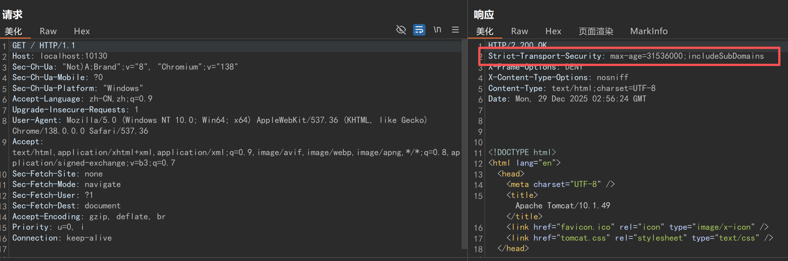

## 指定/禁用TLS弱密码套件

```xml
<!-- 仅启用tls1.2和1.3并且指定密码套件避免弱密码 -->
<SSLHostConfig 
    Protocols="TLSv1.2,TLSv1.3"  
    ciphers="TLS_AES_256_GCM_SHA384,TLS_CHACHA20_POLY1305_SHA256,TLS_AES_128_GCM_SHA256,ECDHE-RSA-AES256-GCM-SHA384,ECDHE-RSA-AES128-GCM-SHA256"> 
</SSLHostConfig>    
```

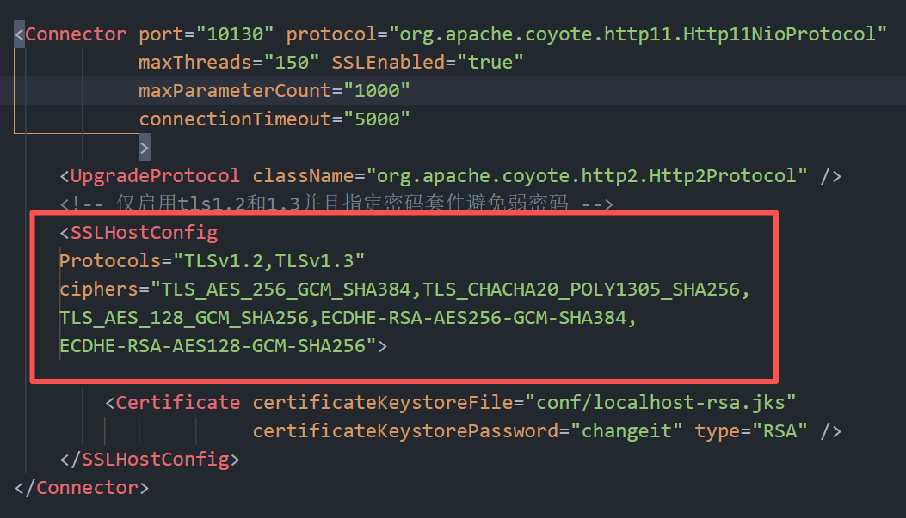

使用nmap扫描检测配置是否生效
```
nmap --script ssl-enum-ciphers -p 10130 127.0.0.1
```

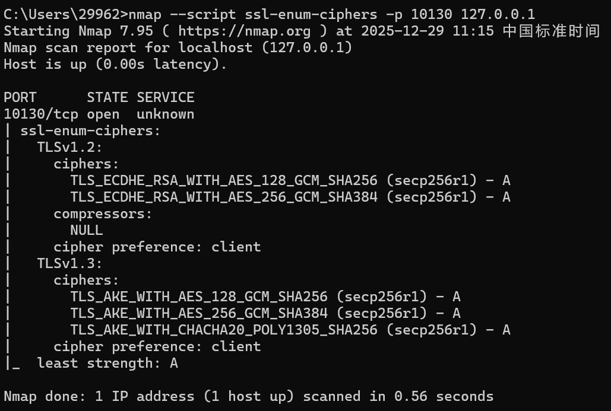

## 去除错误界面的版本信息
在web.xml底部Host标签内增加
```xml
<!-- 去除错误界面的版本信息 -->
    <Valve className="org.apache.catalina.valves.ErrorReportValve"
       showReport="false"
       showServerInfo="false" />
```

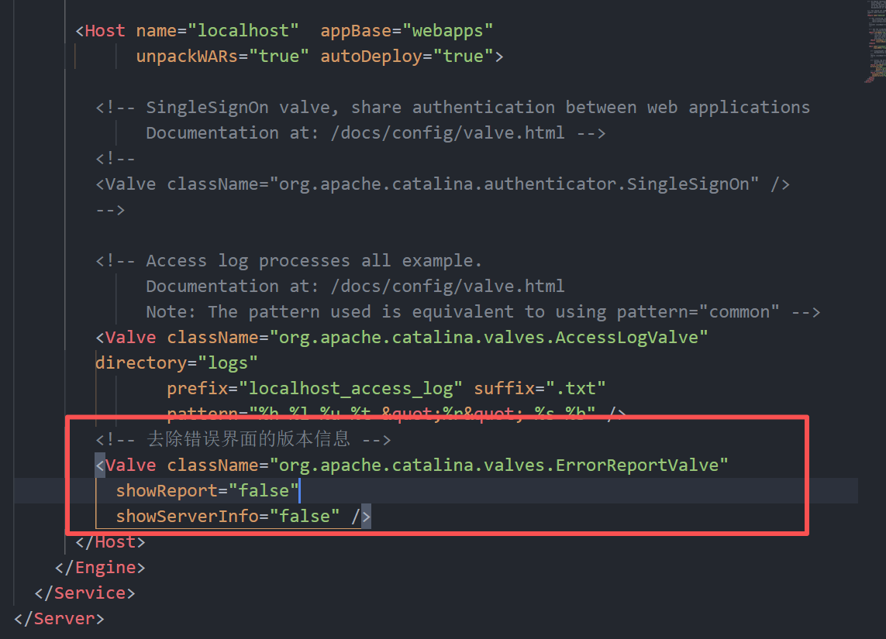

不再显示Tomcat版本信息

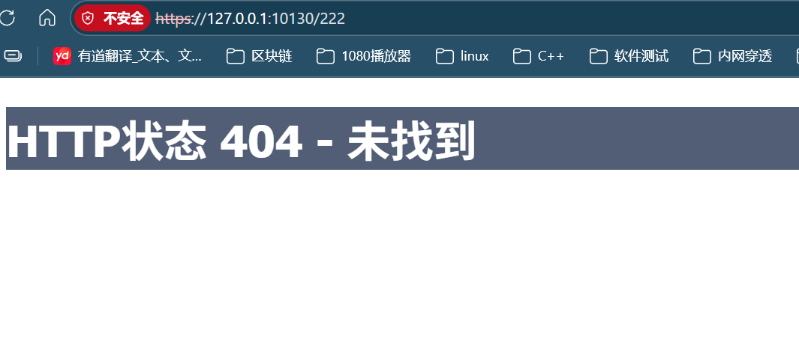

## 去除默认主页面
重命名webapp文件夹下ROOT文件夹，新建一个空的ROOT文件夹，重启tomcat

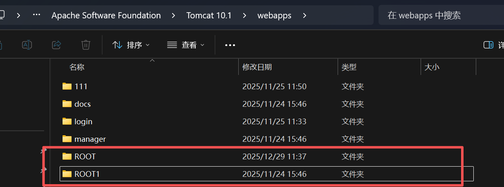