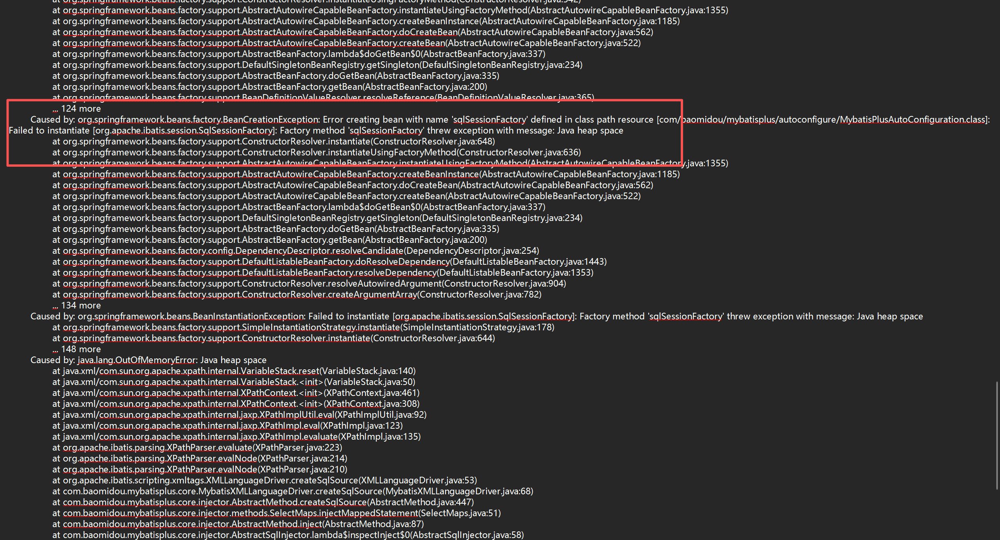
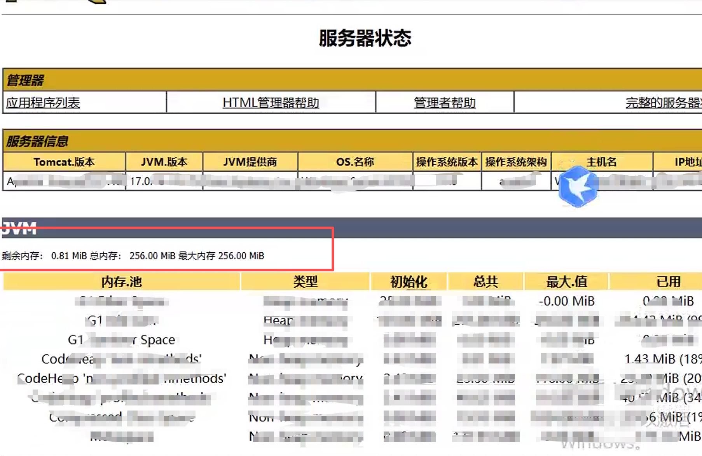
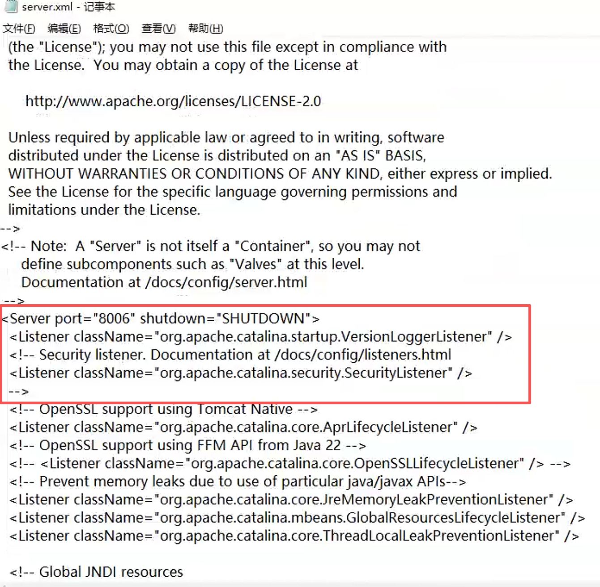
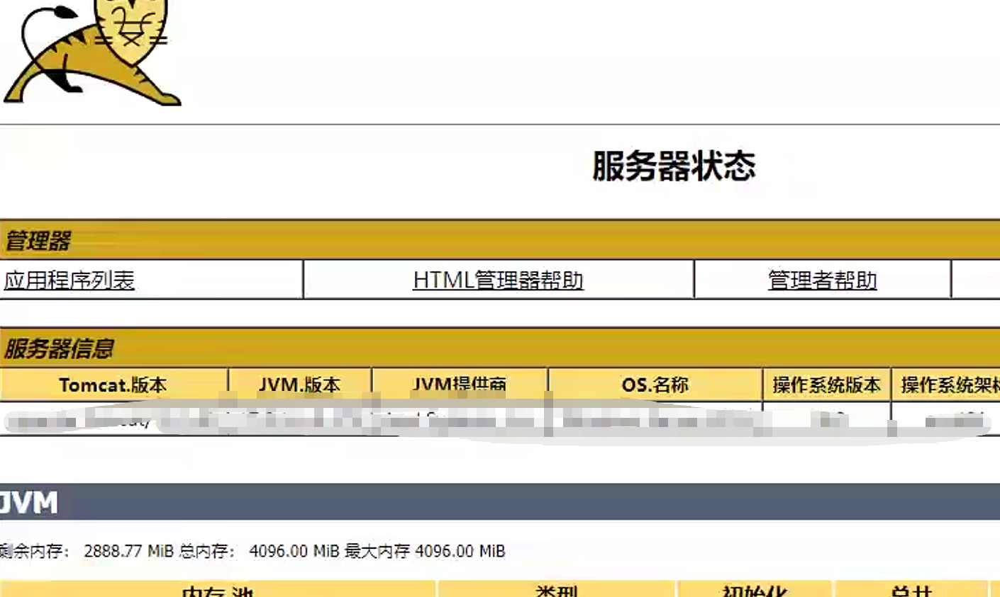

# 记一次项目中遇到的tomcat部署问题(jvm内存溢出)

***提要：最近公司tomcat发布项目的时候出现灵异事件，war包发布的时候10次里面有1，2次能成功，一会又不行了，但是本地是没有任何问题的
我嘞个豆这什么鬼，经过一顿排查...***

## 问题点1：jvm内存分配问题
**根据日志报错信息，提示jvm内存不足，不知道为什么这个tomcat10分配的只有256MB**





**知道问题那就很简单了直接修改jvm内存就可以了，结果引出了一堆历史问题...**

## 问题点2：服务器由于之前业务需求，有俩tomcat，分别是9和10，而java也有俩，emmm一整个就是牛头不对马嘴，初步排查10的java指向有问题，故此第一步先修改正确指向
**新建setenv.bat脚本并添加指定路径，最终内容如下**
```shell
@echo off
set "JAVA_HOME=G:\zulu-17"
set "JRE_HOME=G:\zulu-17"
set "CATALINA_OPTS=%CATALINA_OPTS% -Xms4096m -Xmx4096m"
```

## 问题点3：在使用tomcat10的shutdown脚本时报错端口占用
**正如我前面所说的，因为有两个tomcat，因此这里需要修改shutdown的端口**<br>
***tips:在多tomcat环境的情况下，并不是光改监听端口就可以了，其他的服务也需要修改，否则会影响关闭(根据实际端口修改即可)***

|端口用途|默认端口|建议 Tomcat 9 端口|建议 Tomcat 10 端口|
|:--|:--|:--|:--|
|HTTP连接端口|8080|8080|8081|
|SHUTDOWN端口|8005|8005|8006|
|AJP连接端口|8009|8009|8010|

**修改冲突端口**



**最终成功解决，war包正常发布了**

