# 东方通TongWeb基础部署
 <br>
***使用版本：TongWeb 8.0.6.2***<br>
***系统版本：银河麒麟 V10（服务器版）***

## 一、前置准备
### 需准备材料
***1、许可证***<br>
***2、压缩包***<br>

**新建tongweb文件夹，将所需文件放置目录下**

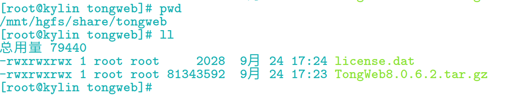

解压压缩包
```shell
tar -zxvf TongWeb8.0.6.2.tar.gz 
```
将许可证放置解压文件根目录下
```shell
mv ../license.dat  ../TongWeb8.0.6.2 //根据实际路径
```
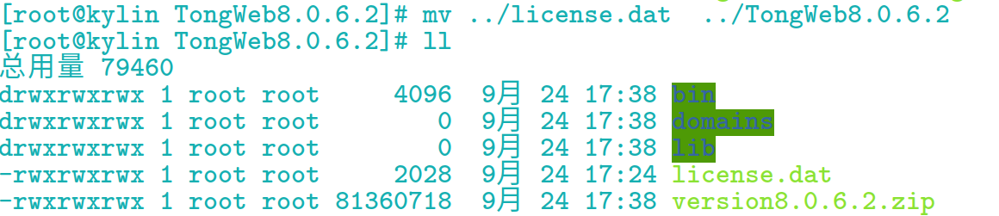

**根目录文件说明**
| **文件名称** | **文件说明** |
| :------- | :------- |
|bin|可执行文件|
|domains|已建立的实例的存放位置|
|lib|全域共享的 jar 包 lib/app 目录下为应用共享的 jar 包|
|version*.zip|对应产品版本的库文件|
|license.dat|安装的 TongWeb License 文件|

## 二、JDK环境
**JDK 版本要求：JDK8-JDK21**

**安装jdk部分：略<br>**
>在命令行界面，输入“java -version”。<br>
若回显信息为Java 版本，说明安装成功。

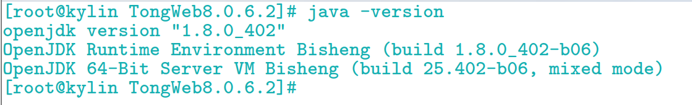

**配置jdk环境变量(按照实际路径)**<br>
```shell
vim /etc/profile
```
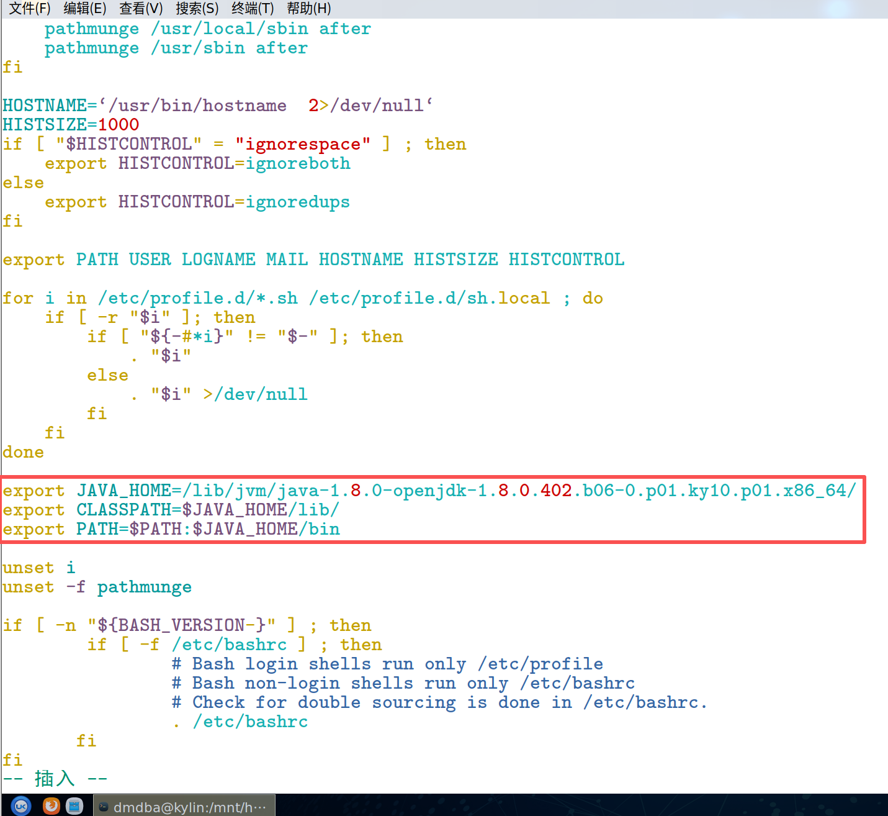

**配置完成刷新文件源**
```shell
source /etc/profile
```
## 三、设置可信任IP
**登录 TongWeb 管理控制台需要是信任IP，需要在安装前将远程浏览器访问 TongWeb 的主机 IP 设置为“信任IP”。**
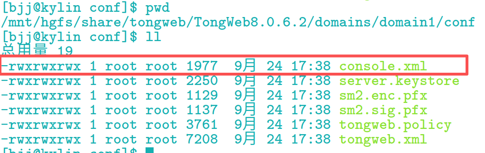

**文件路径：** <mark>/domains/domain1/conf/console.xml</mark>

>根据实际IP修改，空代表只有本地可以访问，*表示信任所有IP（不推荐使用）在Tongweb运行时，文件具有防篡改属性无法修改，需要停止后修改（或在控制台中修改）

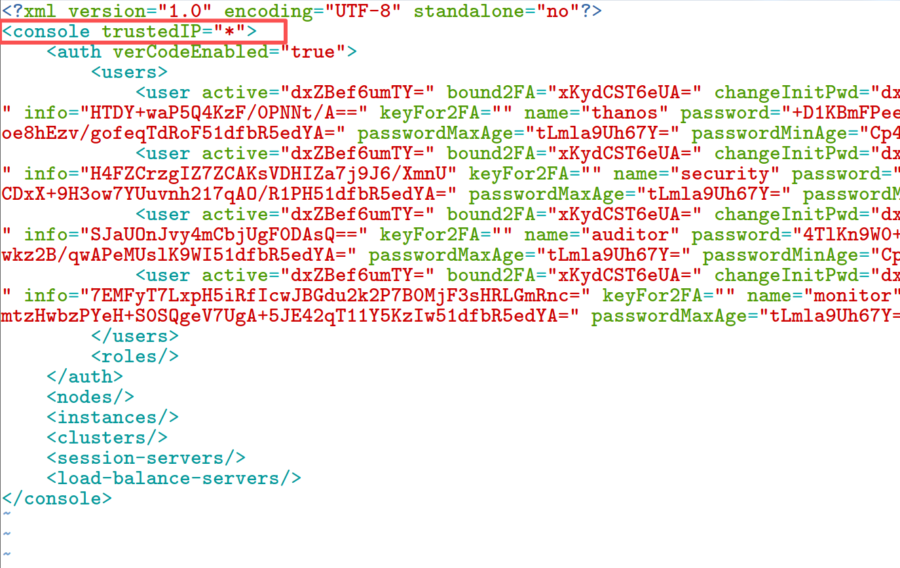

## 四、修改Linux文件描述符限制
**当前系统限制**<br>
```shell
ulimit -a   //或ulimit -n
```
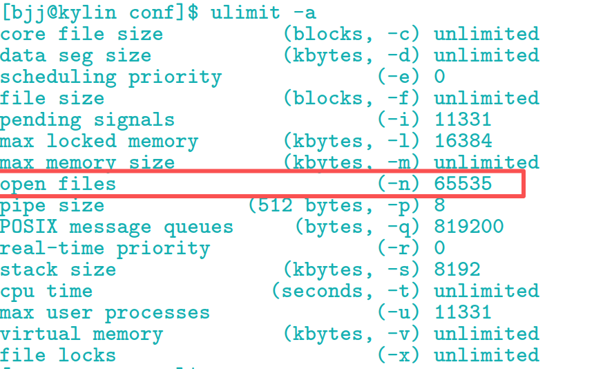

**修改最大文件打开数量为65535，默认1024
文件路径：<mark>/etc/security/limits.conf</mark>**
```shell
* soft nofile 65535
* hard nofile 65535
```
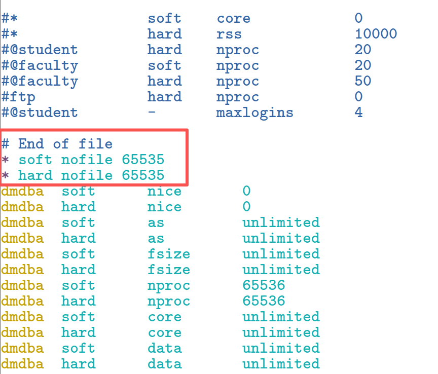

**给bin目录下的所有文件授权**<br>
```shell
chmod -R 755 bin/*
```
## 五、启动tongweb
**startserver.sh在控制台中运行，使用xshell等远程工具断连时可以会停止进程
建议使用startd.sh后台运行**
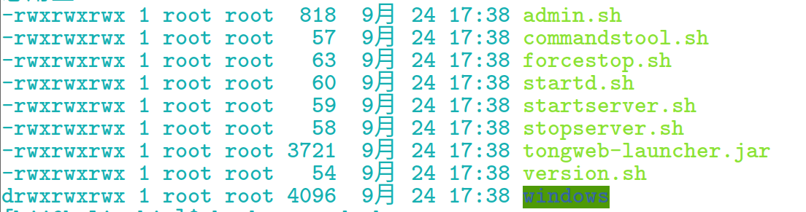

***Tips:我用的挂载共享盘，启动时候会报错找不到java，使用sudo bash startd.sh 即可***
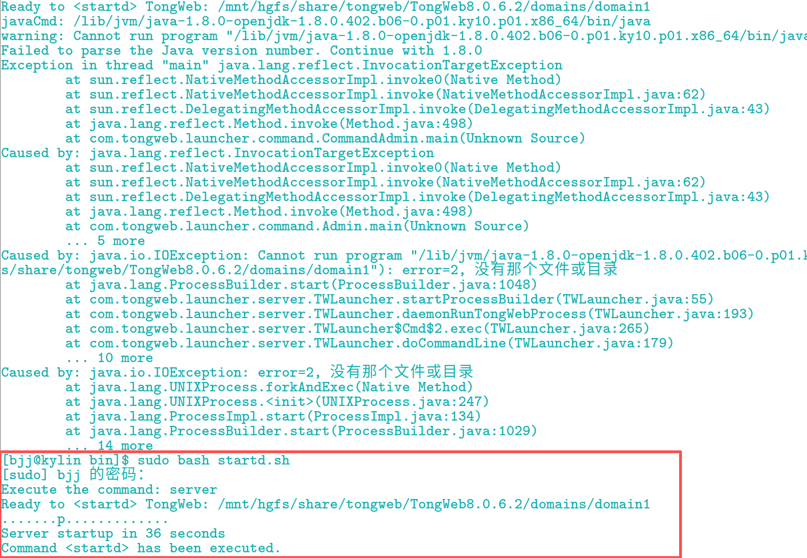

**访问控制台**
https://localhost:9060/console/<br>

>**默认账号**：thanos<br>
**默认密码**：thanos123.com

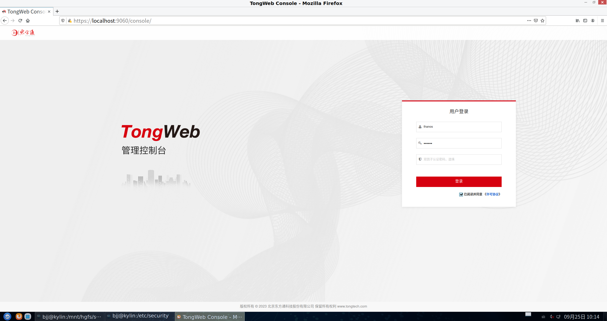

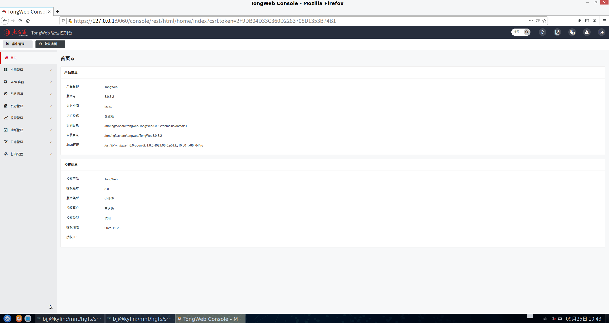

***Tips:忘记密码可以到 <mark>/domains/domain1/conf/console.xml</mark> 中修改为默认密码***
>password=+D1KBmFPeeH+vd1mVJevToDbCWEguO4N3eccW/vChedAaQ4CXwScDS8ayzvOF53QgWlIBsZuV2Nb6foe8hEzv/gofeqTdRoF51dfbR5edYA=

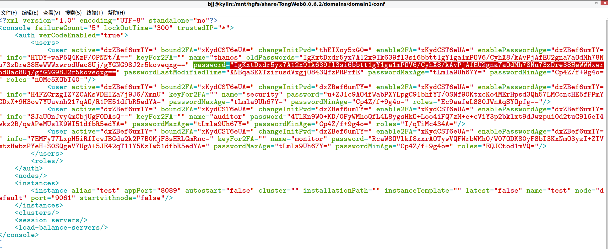
