# 东方通TongWeb应用部署

 
***使用版本：TongWeb 8.0.6.2*** 
***系统版本：银河麒麟 V10（服务器版）*** 
***数据库：mariadb*** 

## 一、前置准备
### 需准备材料
***1、连接URL*** 
***2、驱动类*** 
***2、数据库连接账号密码*** 
***2、相应版本对应的JDBC的 jar 驱动包*** 

## 二、创建数据源
### 资源管理-数据源-创建
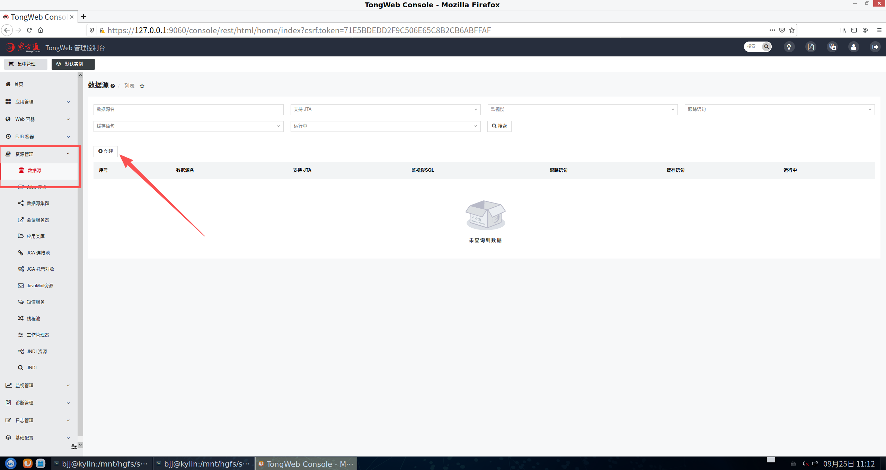 
**新增数据源**
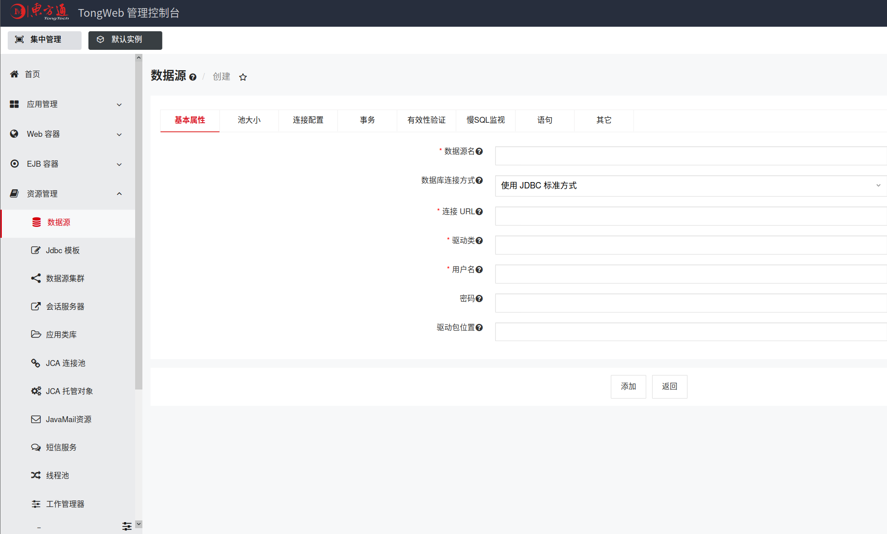 

|参数|参数说明|示例|
| :------- | :------- | :------- |
|数据源名|数据源名称|testdb|
|别名|数据源的别名被用作绑定到 JNDI 资源树上的名称|不填写|
|数据库连接方式|使用 TongWeb 预置的 Jdbc 模板连接数据库|使用 JDBC 标准方式|
|连接URL|数据库连接URL。请根据实际环境填写|jdbc:mysql://168.1.13.108:3316/zmm2|
|驱动类|数据库驱动类的全名称|com.mysql.cj.jdbc.Driver|
|用户名|登录数据库的用户名|root|
|密码|登录数据库用户名对应的密码|****(请根据实际环境填写)|
|驱动包位置|设置数据库驱动类Jar文件在服务器上的绝对路径。多个路径以“,”分隔。•若在TongWeb启动前，已经将驱动包文件放置到“${tongweb.base}/lib”，则可不设置驱动Jar的位置。例如存放在默认实例下：“${tongweb.home}/domains/domain1/lib/mysqlconnector-java-8.0.11.jar”•若在TongWeb启动后再放置，则需要重启TongWeb服务器才能生效|不填写|

>官方文档里面使用的是mysql，我这里使用的是mariadb所以驱动配置会有所修改（结尾附常见数据库的驱动类名、JDBC URL格式示例）

**将驱动包放到/domains/domain1/lib/下（对应驱动包自行官网下载）**

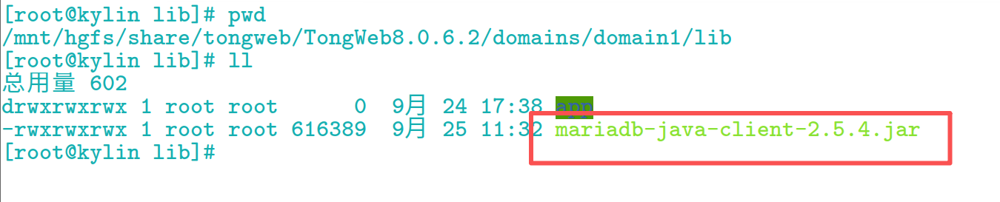 

**控制台输入对应参数（这里以mariadb为例）**

>由于 “examples.war” 的 “jdbc > noXaDsWeb” 示例中已配置好数据源名称 “testdb”，因此创建的数据源名称必须为 “testdb”。

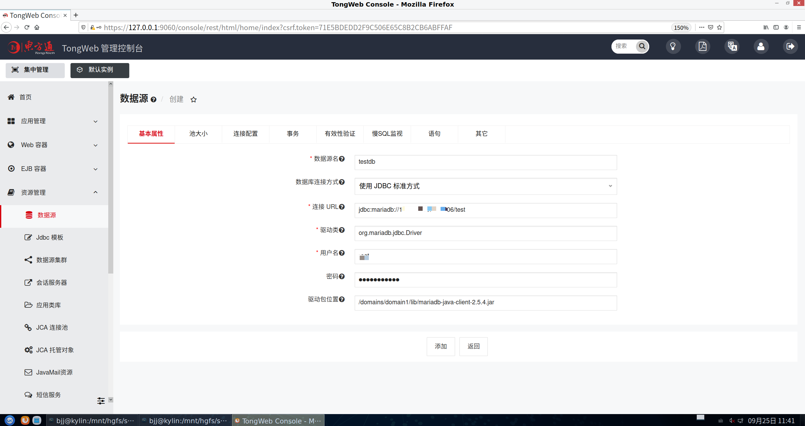 

**添加完成后测试数据库连通性**

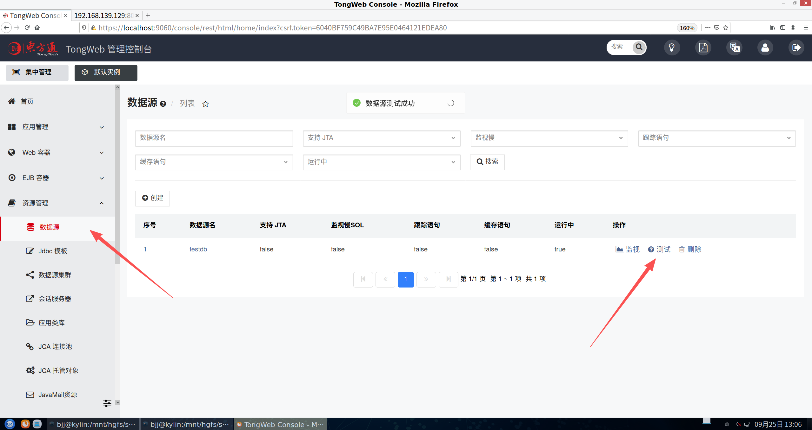 

## 三、部署应用
### 应用管理-应用-新增

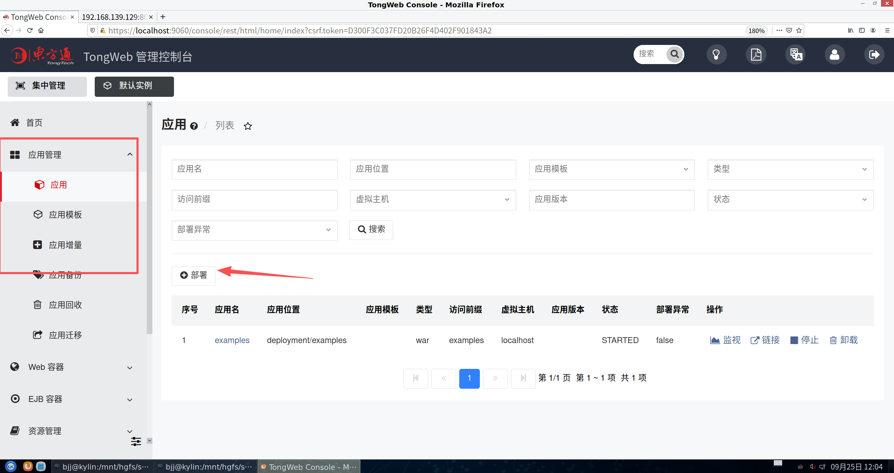 

>**东方通自带测试war包** 
/version8.0.6.2/examples/examples.war //根据实际路径填写添加

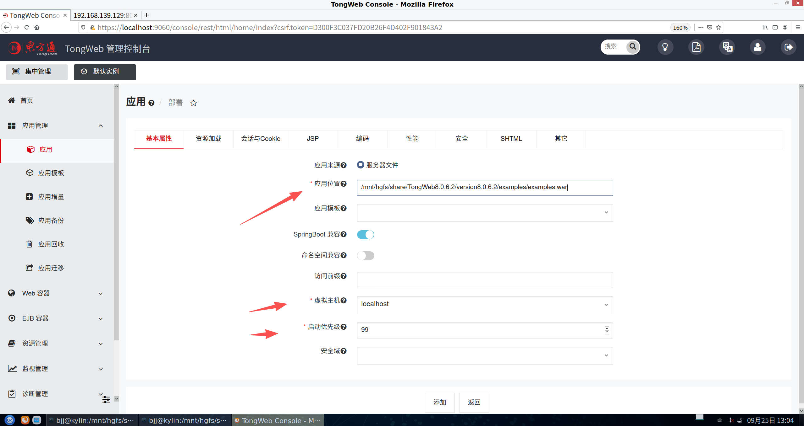 

**访问应用链接**
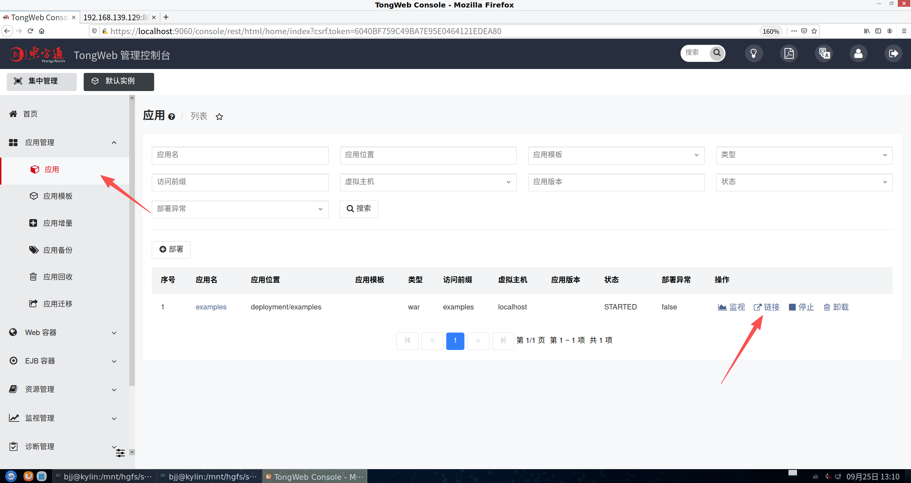 
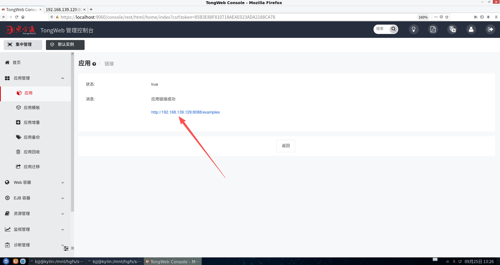 

>**点击Jdbc NoXaDataSource创建数据表，看能否通过应用对数据库进行操作**

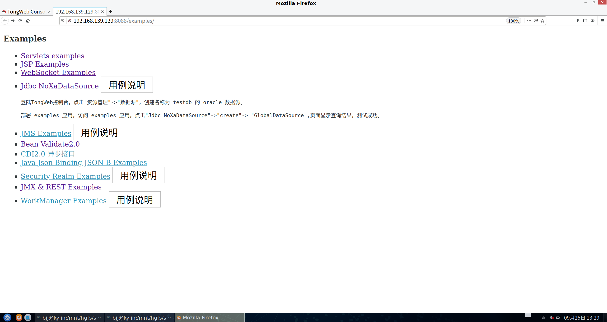 
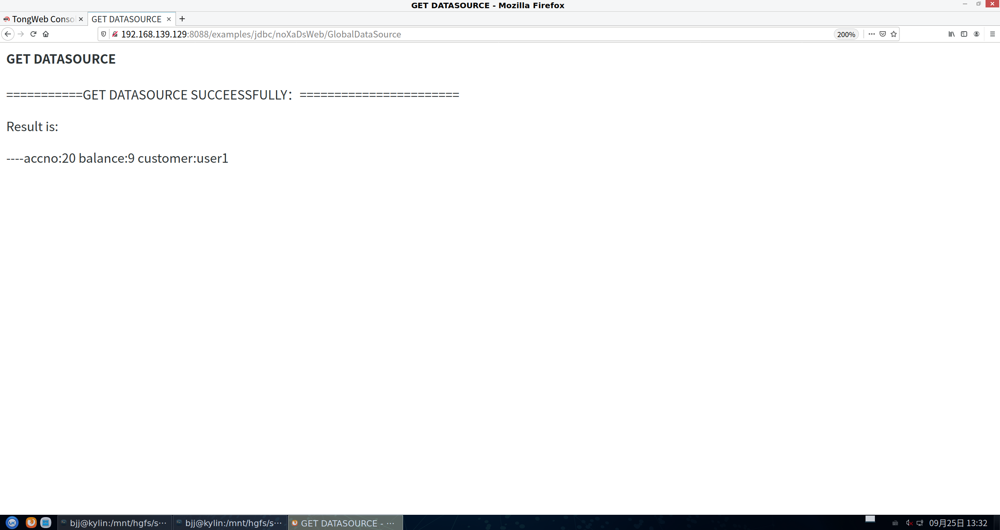 
**查看数据库成功创建**
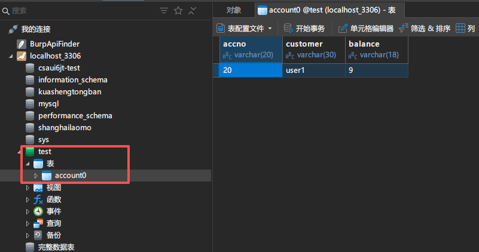 

***tips：TongWeb自带好几个war包，可以一一尝试测试***

## 四、数据库类型	驱动类名 (Driver Class Name)	JDBC URL 格式示例 (仅供参考) 
>***传统/常见数据库*** 
**MySQL	com.mysql.jdbc.Driver com.mysql.cj.jdbc.Driver (新版本推荐)	jdbc:mysql://host:port/database 
MariaDB	org.mariadb.jdbc.Driver	jdbc:mariadb://host:port/database 
Oracle	oracle.jdbc.driver.OracleDriver	jdbc:oracle:thin:@host:port:SID 
PostgreSQL	org.postgresql.Driver	jdbc:postgresql://host:port/database 
SQL Server	com.microsoft.sqlserver.jdbc.SQLServerDriver	jdbc:sqlserver://host:port;databaseName=database 
DB2	com.ibm.db2.jcc.DB2Driver	jdbc:db2://host:port/database **

>***国内信创数据库*** 
达梦 (DM)	dm.jdbc.driver.DmDriver	jdbc:dm://host:port/[database] 
人大金仓 (Kingbase)	com.kingbase8.Driver (V8) com.kingbase.Driver (旧版本)	jdbc:kingbase8://host:port/database 
神通数据库 (OSCAR)	org.postgresql.Driver (基于PostgreSQL内核)	jdbc:postgresql://host:port/database 
南大通用 (GBase)	com.gbase.Driver (例如 GBase 8c) com.gbase.jdbc.Driver (请以官方文档为准)	jdbc:gbase://host:port/database 
虚谷数据库 (Xugu)	com.xugu.cloudjdbc.Driver	jdbc:xugu://host[:port]/[database] 
海量数据 (Vastbase)	org.postgresql.Driver (基于PostgreSQL)	jdbc:postgresql://host:port/database 
瀚高数据库 (HighGo)	org.postgresql.Driver (基于PostgreSQL)	jdbc:postgresql://host:port/database 
优炫数据库 (UXDB)	com.uxsino.UxDriver (请以官方文档为准)	jdbc:uxdb://host:port/database 