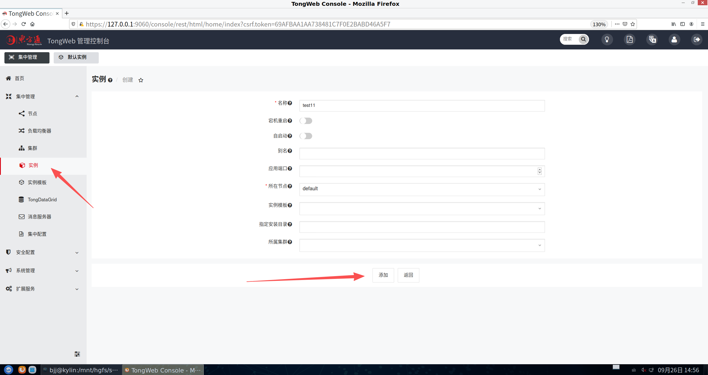
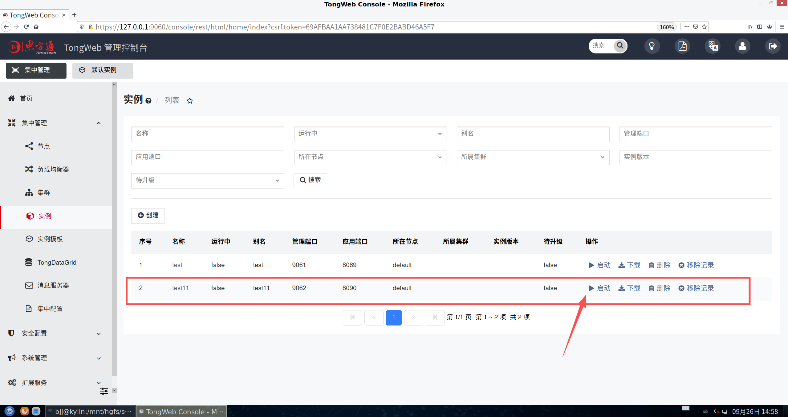
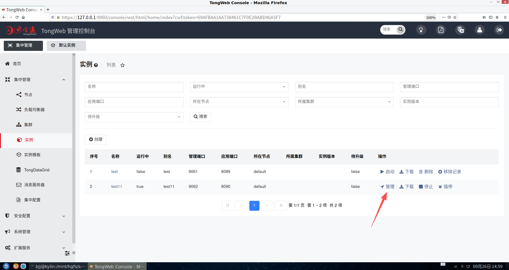
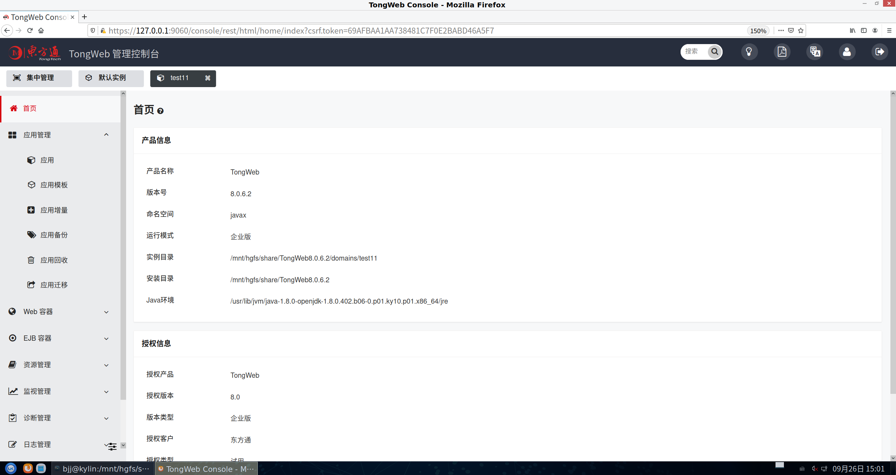
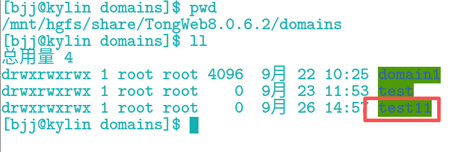
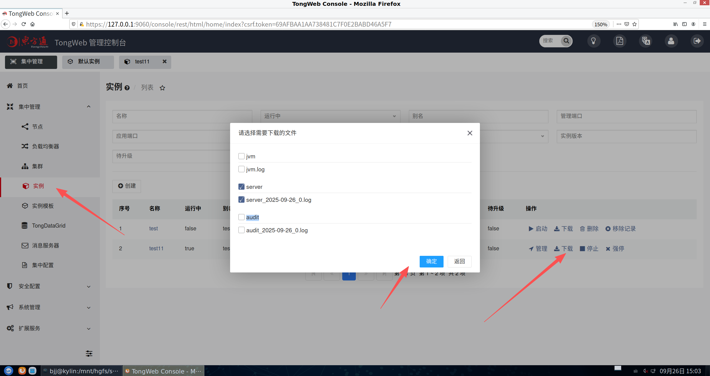

# 东方通TongWeb实例管理
  
***使用版本：TongWeb 8.0.6.2*** 
***系统版本：银河麒麟 V10（服务器版）***

## 一、多实例场景
### 通常情况下一台服务器只需要安装一套TongWeb。若存在如下场景，则可通过创建多个实例的方式解决。
|场景|场景说明|
|:---|:---|
|场景一|服务器CPU、内存比较大，可通过创建多个TongWeb实例，充分利用系统资源|
|场景二|不同应用需要使用不同JDK版本，关于如何给不同实例配置不同的JDK版本，请参见不同实例配置不同JDK版本|
|场景三|应用之间互相冲突，需要分别部署在不同TongWeb实例上|
|场景四|应用有内存溢出或占用线程资源多，频繁出问题的放一个TongWeb实例上运行，不影响其它应用|

## 二、创建实例
### **集中管理-实例-创建** 
***根据实际情况填写对应参数***

## 三、启动实例
***添加完成后启动实例***

## 四、切换实例
***点击管理来到实例管理页***

***查看创建的实例文件***

## 五、下载日志

### 实例所在节点处于“启动中”时，您才可以下载该实例运行的日志，包含 
>**gc.log、jvm.log、access.log、server.log、audit.log 等。** 
### 注意事项 
>**控制台默认关闭文件下载功能。若需要开启，请参见禁用文件下载。** 

### 前置条件 
>- **已获取系统管理员（thanos）账号和密码** 
>- **实例列表已有实例** 
>- **实例所在节点“运行中”为“true”** 

