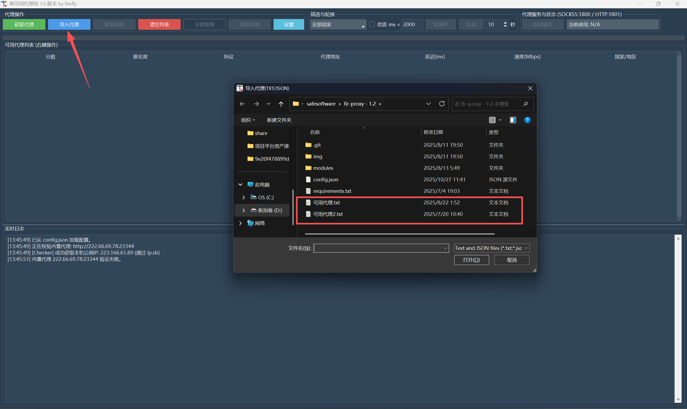
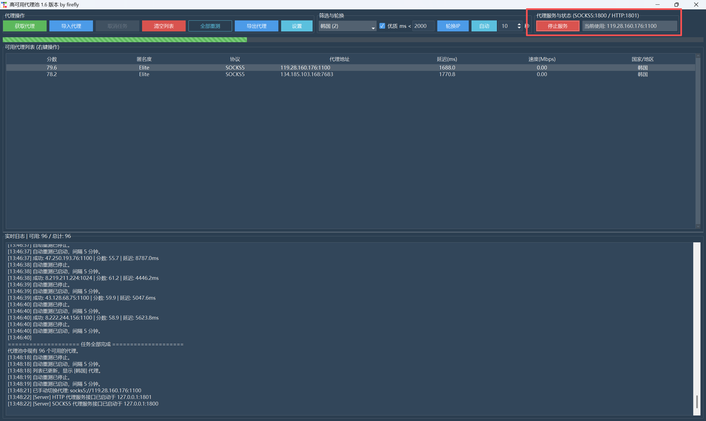
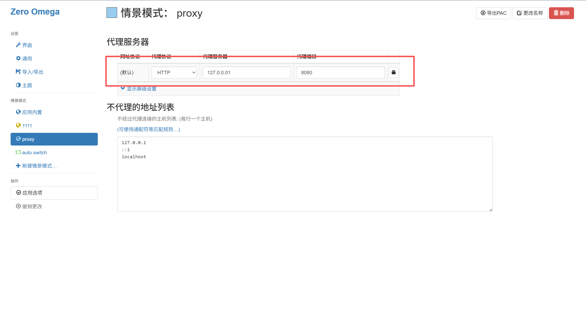
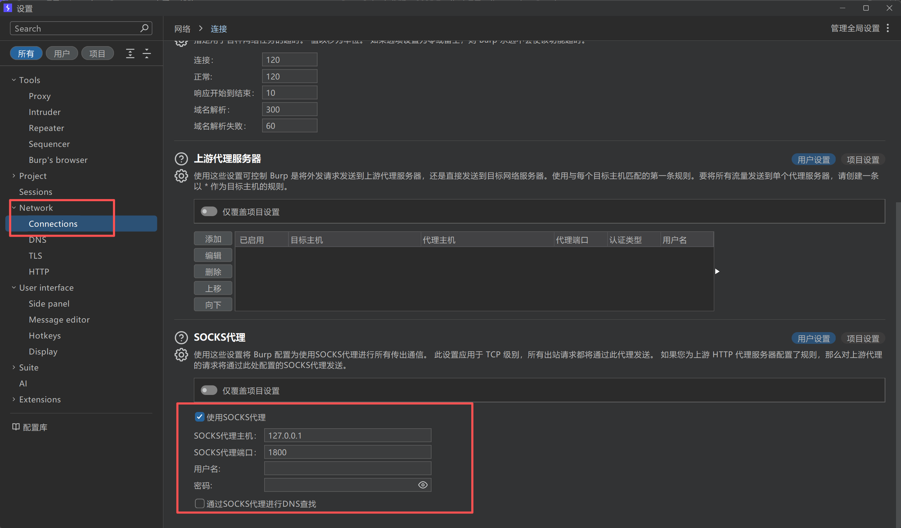
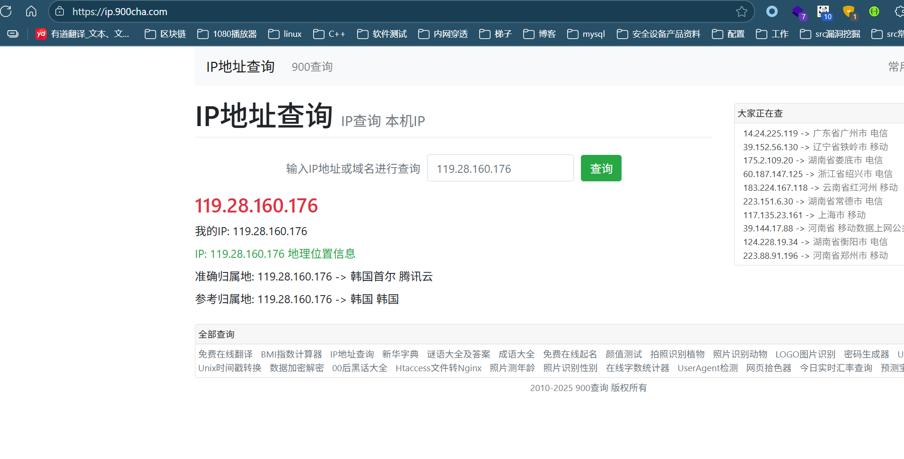

# BurpSuite配置代理池
***声明：本文章仅用于讲解分享如何配置二级代理（即浏览器代理到burpsuite，burpsuite再代理到代理池）不涉及任何非法行为***

## 下载代理池工具
代理池项目地址：https://github.com/11firefly11/fir-proxy

### 安装fir-proxy
在fir-proxy项目文件路径下
```python
//  安装依赖包
pip install -r requirements.txt
//  启动代理池
python main.py
```

### 导入代理（可以使用自带的，也可以添加自己的代理池ip）



### 查看SOCKS5使用的端口



## 配置一级代理
<big>**浏览器使用代理插件，新建规则代理到burpsuite**</big><br>



***tips:插件商店随便下一个就行，代理规则需以实际环境填写***
## 配置二级代理
<big>**BurpSuite配置SOCKS代理到fir-proxy（此为二级代理）**</big>



***tips:这里配置的是SOCKS代理注意别配错地方，按照实际走的端口填写，勾选使用SOCKS代理即可***
## 测试代理连通性
<big>**查看代理连通性及是否代理成功**</big><br>



***tips:随便找个网站看自己ip即可***