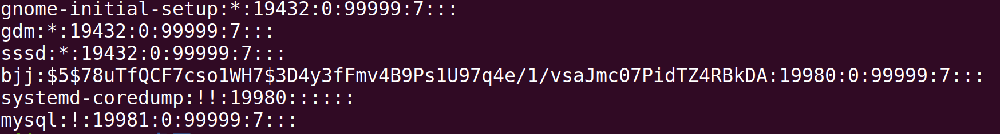

# ***1、检查系统用户***

|**命令**|**说明**|
|:--|:--|
|cat/etc/passwd|查看是否有异常的系统用户|


>/etc/passwd 是一个文本文件，其中包含了登录 Linux 系统所必需的每个用户的信息。它保存用户的有用信息。<br>如<用户名：密码：用户 ID：群组 ID：用户 ID 信息：用户的根目录：Shell<br><br>
**1、用户名（root）**： 已创建用户的用户名，字符长度 1 个到 12 个字符。<br><br>
**2、密码（x）**：代表加密密码保存在 `/etc/shadow 文件中。<br><br>
**3、用户 ID（0）**：代表用户的 ID 号，每个用户都要有一个唯一的 ID 。UID 号为 0 的是为 root 用户保留的，UID 号 1 到 99 是为系统用户保留的，UID 号 100-999 是为系统账户和群组保留的。<br><br>
***4、群组 ID （0）***：代表群组的 ID 号，每个群组都要有一个唯一的 GID ，保存在 /etc/group文件中。<br><br>
***5、用户信息（root）***：代表描述字段，可以用来描述用户的信息（LCTT 译注：此处原文疑有误）。<br><br>
***6、根目录（/root）***：代表用户的家目录<br><br>
***7、Shell（/bin/bash）***：代表用户使用的 shell 类型。

|**命令**|**说明**|
|:--|:--|
|cat/etc/shadow|存储 Linux 系统中用户的密码信息，又称为“影子文件”|


>早期的 UNIX 密码放在 /etc/passwd 文件中，由于该文件允许所有用户读取，易导致用户密码泄露，因此将密码从 /etc/passwd 文件中分离出来，并单独放到了此文件中。/etc/shadow 文件只有 root 用户拥有读权限，保证了用户密码的安全性。如：用户名：加密密码：密码最后一次修改日期：两次密码的修改时间间隔：密码有效期：密码修改到期到的警告天数：密码过期之后的宽限天数：账号失效时间：保留

<mark>***哈希密码可以使用john进行破解***</mark>

***入侵排查其他常用命令***

|**命令**|**说明**|
|:--|:--|
|grep "0" /etc/passwd|查看是否产生了新用户，UID和GID为0的用户|
|ls -l /etc/passwd|查看passwd的修改时间，判断是否在不知的情况下添加用户|
|```awk -F: '$3==0 {print $ 1}' /etc/passwd```|查看是否存在特权用户|
|```awk -F: 'length($ 2)==0 {print $1}' /etc/shadow```|查看是否存在空口令帐户|
|more /etc/sudoers &#124; grep -v "^#&#124;^$" &#124; grep "ALL=(ALL)"|除root帐号外，其他帐号是否存在sudo权限|
|usermod -L user|禁用帐号，帐号无法登录，/etc/shadow第二栏为!开头|
|userdel user|删除user用户|
|userdel -r user|将删除user用户，并且将/home目录下的user目录一并删除|

# ***2、查看历史命令***
linux系统默认会记录用户输入的命令，保存到一个.bash_history隐藏文件中，ls -al命令可以查看隐藏文件<br>

<mark>***history命令可以查看root用户的历史命令***</mark><br>


- 注意wget（有可能是下载木马文件），ssh（可能是异常连接内网主机），tar zip（数据打包），系统配置命令可能是修改系统相关配置
<br><br>如：登录ssh


- 在/home各账户目录下，cat /用户/.bash_history也可以查看普通用户的历史命令。<br><br>例如，查看用户 john 的历史记录：
```shell
cat /home/bjj/.bash_history
```
# ***3、检查异常端口***

|**命令**|**说明**|
|:--|:--|
|netstat -antlp|检查端口|
|ls -l /proc/$PID/exe|查看pid所对应的进程文件路径|


- 查看PID对应路径


使用telnet连接


# ***4、检查异常进程***

>使用ps命令结合aux，grep选项查看linux系统下的进程信息，还可以使用top命令查看是否有挖矿，木马病毒占用大量的系统资源

|**命令**|**说明**|
|:--|:--|
|ps aux &#124; grep pid|分析进程|
|ps -efe|查看进程|
|lsof -p pid|查看进程打开的端口和文件|


# ***5、计划任务排查***

# ***6、异常文件检查***

# ***7、检查系统日志***

# ***8、开机启动项***

# ***9、检查服务***

# ***10、确保Linux系统安全***

