# :computer: ***应急响应操作手册（Windows篇）***</big>

### **什么时候该开展应急响应**

服务器被入侵，业务出现蠕虫事件，用户以及公司员工被钓鱼攻击，业务被 DDoS 攻击，核心业务出现DNS、链路劫持攻击等等

### **如何开展应急响应**

>确定攻击时间<br>
查找攻击线索<br>
梳理攻击流程<br>
实施解决方案<br>
定位攻击者

### **常见应急响应事件分类**

>web入侵：网页挂马、主页篡改、Webshell<br>
系统入侵：病毒木马、勒索软件、远控后门、系统异常、RDP爆破、SSH爆破、主机漏洞、数据库入侵等<br>
网络攻击：DDOS攻击、DNS劫持、ARP欺骗<br>
路由器/交换机异常：内网病毒，配置错误等

# 入侵排查思路

## ***1、检查系统账号安全*** :pushpin:

- 查看服务器是否存在可疑账号、新增账号
```
1、打开 cmd 窗口或 Win+R，输入 lusrmgr.msc 命令，查看是否有新增/可疑的账号，如有管理员群组的（Administrators）里的新增账户
```
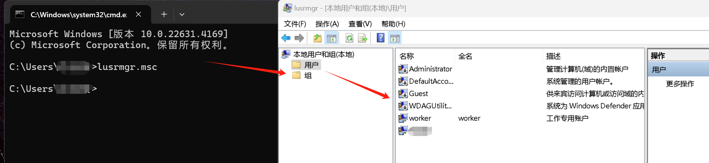

- 查看服务器是否存在隐藏账号、克隆账号
```
1、打开cmd窗口，输入regedit，查看注册表编辑器,观察管理员对应键值；
2、选择 HKEY_LOCAL_MACHINE/SAM/SAM，默认无法查看该选项内容，右键菜单选择权限，打开权限管理窗口；
3、选择当前用户（一般为 administrator），将权限勾选为完全控制，然后确定。关闭注册表编辑器；
4、再次打开注册表编辑器，即可选择HKEY_LOCAL_MACHINE/SAM/SAM/Domains/Account/Users；
5、在 Names 项下可以看到实例所有用户名；
```
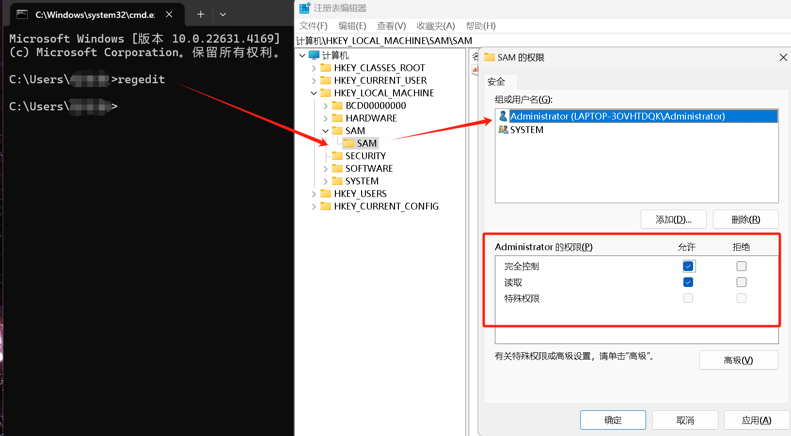


<mark>***注意：如出现本地账户中没有的账户，即为隐藏账户，在确认为非系统用户的前提下，可删除此用户。***</mark>
```
使用D盾_web查杀工具，集成了对克隆账号检测的功能
```

- 查看服务器是否有弱口令，远程管理端口是否对公网开放
```
可咨询服务器相关管理员
```

- 结合日志，查看管理员登录时间、用户名是否存在异常。
```
1、 打开cmd，输入"eventvwr.msc"，回车运行，打开“事件查看器”
2、 导出 Windows 日志 – 安全
3、 用微软官方工具 Log Parser 进行分析 
下载地址：https://www.microsoft.com/enus/download/details.aspx?id=24659
```
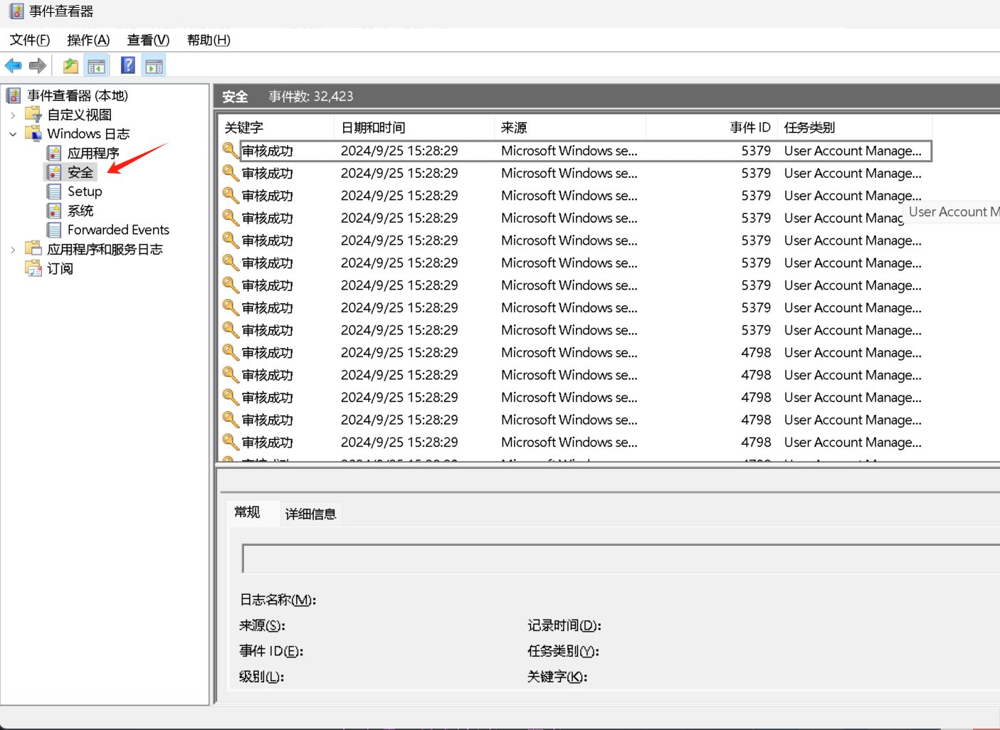

## ***2、检查端口、进程*** :pushpin:
- 检查异常端口

<mark>***是否有远程连接，可疑连接***</mark>
```
1、netstat -ano 查看目前的网络连接，
2、定位可疑的ESTABLISHED：netstat -ano | findstr "ESTABLISHED"
3、根据netstat 定位出的pid，再通过tasklist命令进行进程定位 tasklist | findstr “PID”
4、通过D盾web查杀工具进行端口查看
```

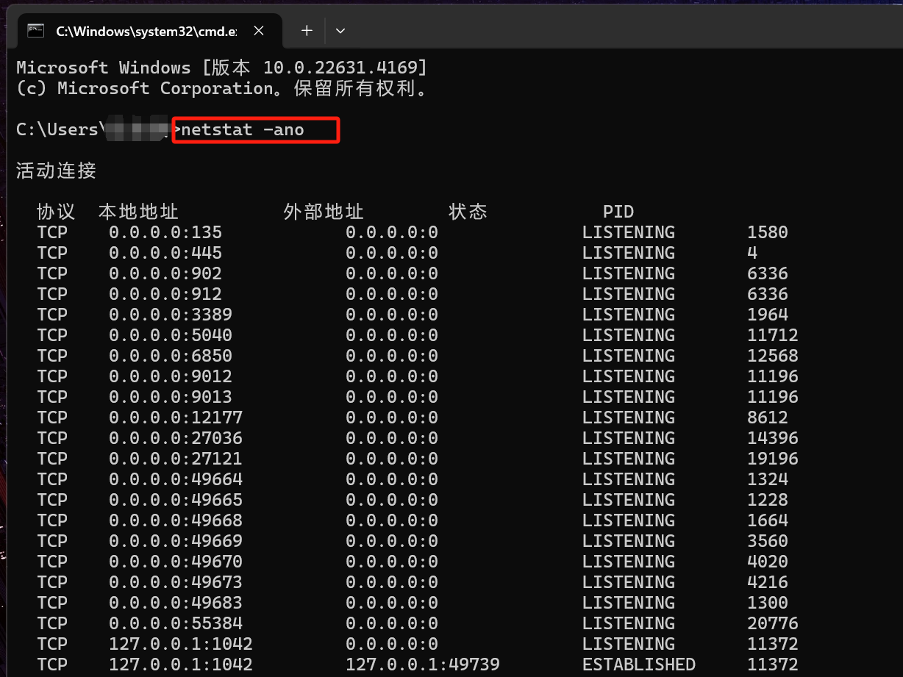

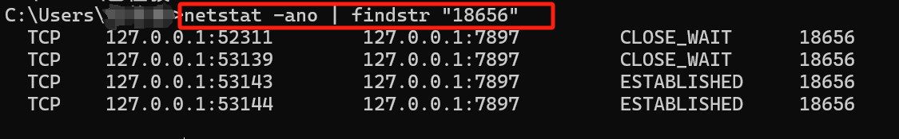

- 检查异常进程
```
1、开始-运行-输入msinfo32，依次点击“软件环境→正在运行任务”就可以查看到进程的详细信息，比如进程路径、进程ID、文件创建日期、启动时间等。
2、打开D盾_web查杀工具，进程查看，关注没有签名信息的进程。
3、通过微软官方提供的 Process Explorer 等工具进行排查 。
```
<mark>***查看可疑进程主要关注点***</mark>
>没有签名验证信息的进程<br>
没有描述信息的进程<br>
进程的属主<br>
进程的路径是否合法<br>
CPU 或内存资源占用长时间过高的进程<br>

## ***3、启动项、计划任务、服务*** :pushpin:

- 检查服务器是否有异常的启动项
```
1、单击【开始】>【所有程序】>【启动】，默认情况下此目录在是一个空目录，确认是否有非业务程序在该目录下
```

<mark>***打开cmd输入gpedit.msc***</mark>

```
2、单击开始菜单 >【运行】，输入 msconfig，查看是否存在命名异常的启动项目，是则取消勾选命名异常的启动项目，并到命令中显示的路径删除文件
```

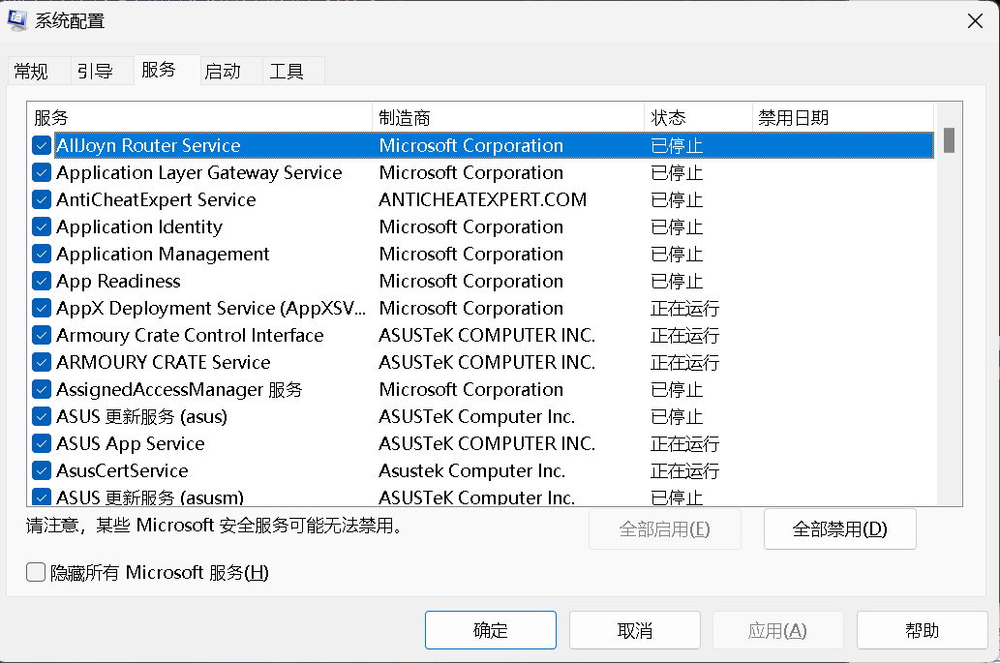

```
3、单击【开始】>【运行】，输入regedit，打开注册表，查看开机启动项是否正常，特别注意如下三个注册表项：
HKEY_CURRENT_USER\Software\Microsoft\Windows\CurrentVersion\run
HKEY_LOCAL_MACHINE\Software\Microsoft\Windows\CurrentVersion\Run
HKEY_LOCAL_MACHINE\Software\Microsoft\Windows\CurrentVersion\Runonce
检查右侧是否有启动异常的项目，如有删除，并安装杀毒软件进行病毒查杀，清除残留病毒或木马。
```

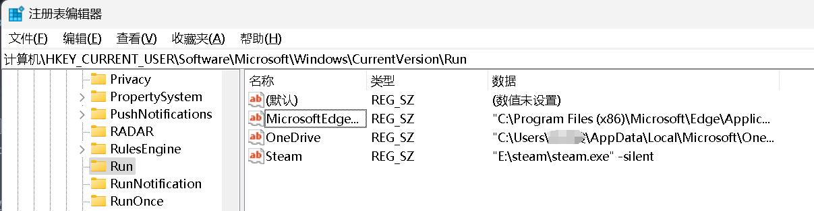

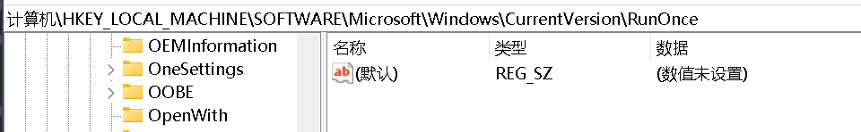

```
4、查看组策略，运行gpedit.msc
```

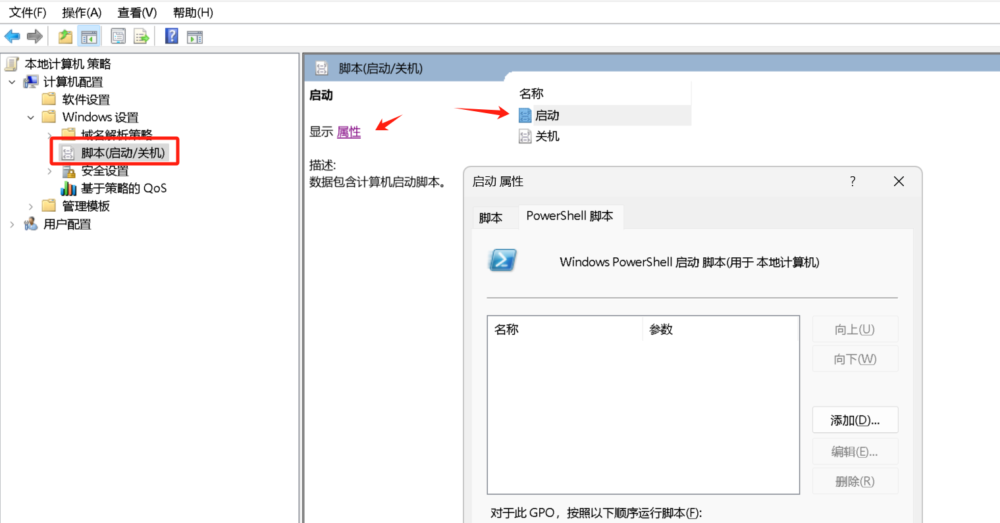

<mark>***检查计划任务***</mark>

```
1、单击【开始】>【设置】>【控制面板】>【任务计划程序】，查看计划任务属性，便可以发现木马文件的路径。(或者在桌面打开运行（可使用快捷键 win+R），输入 control 打开控制面板)
```

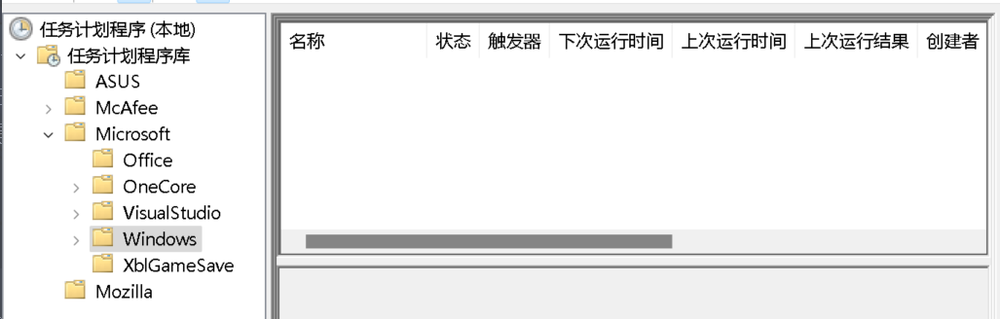

```
2、打开cmd，然后输入 schtasks.exe，检查计算机与网络上的其它计算机之间的会话或计划任务，如有，则确认是否为正常连接。
```

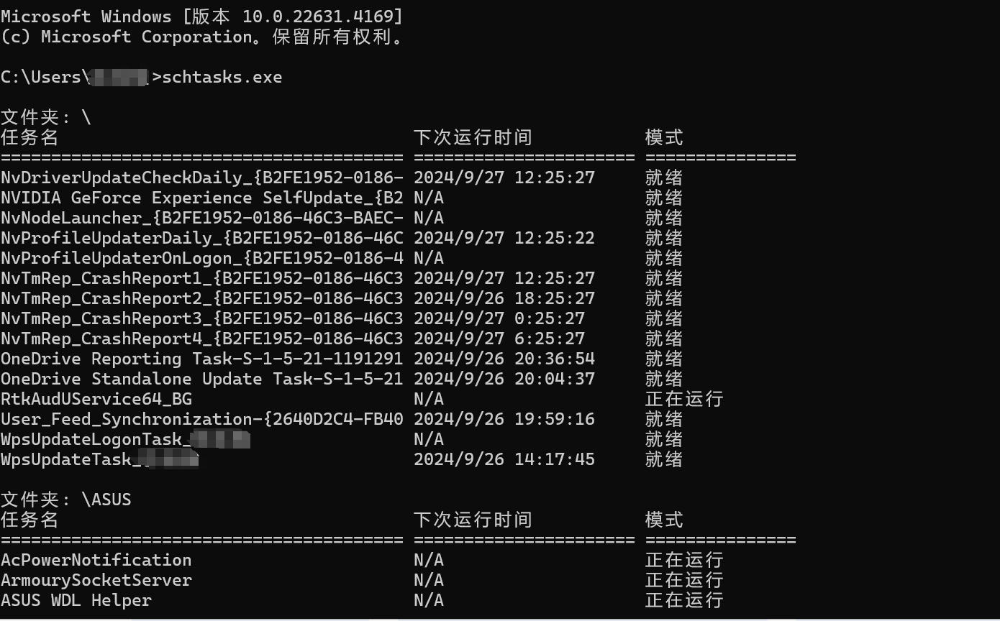

- 服务自启动
>输入 services.msc，注意服务状态和启动类型，检查是否有异常服务

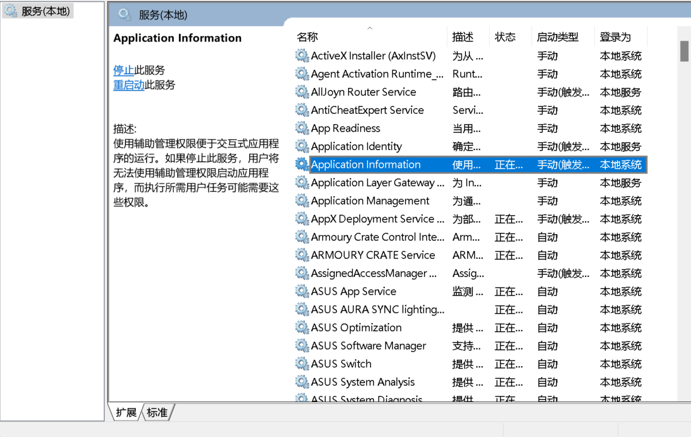

## ***4、事件日志*** :pushpin:
Windows系统日志是记录系统中硬件、软件和系统问题的信息，同时还可以监视系统中发生的事件。用户可以通过它来检查错误发生的原因，或者寻找受到攻击时攻击者留下的痕迹。

- 应用程序日志

应用程序日志是由应用程序自动生成的记录文件，用于记录应用程序运行时的各种信息，包括用户操作、系统状态、错误信息

常见记录方式

```
1、文件记录
2、数据库记录
3、远程日志记录
```

<mark>***日志默认位置：C:\Windows\System32\winevt\Logs\Application.evtx***</mark>

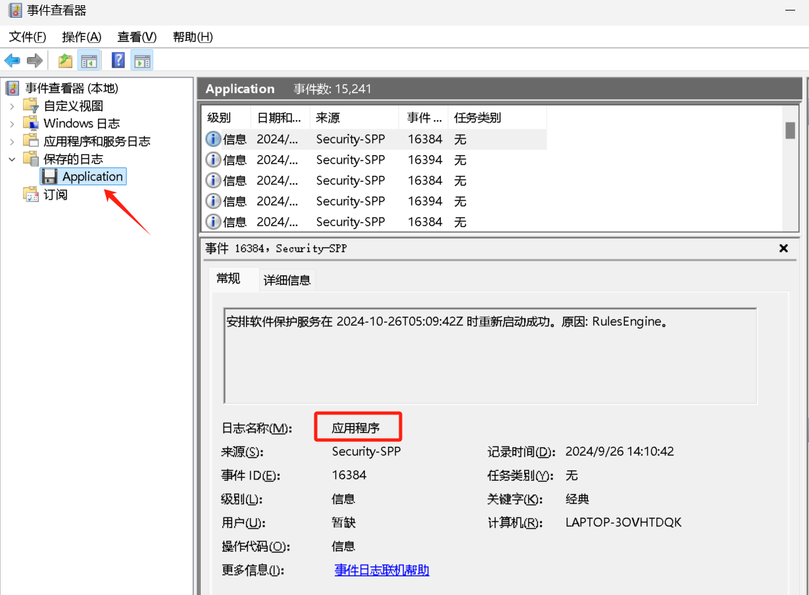

- 系统日志

记录由操作系统组件生成的事件，如启动和关闭信息、硬件和设备信息、性能和资源利用情况等日志默认位置：

<mark>***C:\Windows\System32\winevt\Logs\System.evtx***</mark>

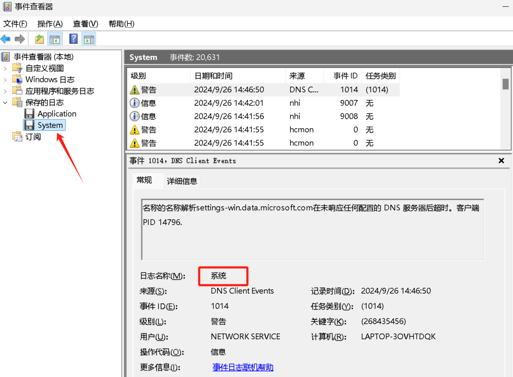

系统日志常用事件ID
|**EVENT ID**|**意义**|
|:--|:--|
|1074|查看计算机的**开机、关机、重启**的时间以及原因和注释|
|6005|表示日志服务已启动，用来**判断正常开机**进入系统|
|6006|表示日志服务已停止，用来**判断系统关机**|
|6009|表示非正常关机， 按**ctrl、alt、delete键关机**|
|41|表示系统在未先正常关机的情况下重新启动。当出现**意外断电关机**、系统崩溃时|
|4199|当发生**TCP/IP地址冲突**的时候，出现此事件ID，用来排查用户IP网络的问题|
|35,36,37|记录时间客户端状态信息，35表示**更改时间源**，36表示**时间同步失败**，37表示**时间同步正常**|
|134|当出现时间同步源DNS解析失败时|
|7045|服务创建成功|
|7030|服务创建失败|

- 安全日志

记录与系统安全相关的事件，如登录和注销、权限变更、异常访问等

<mark>***日志默认位置：C:\Windows\System32\winevt\Logs\Security.evtx***</mark>

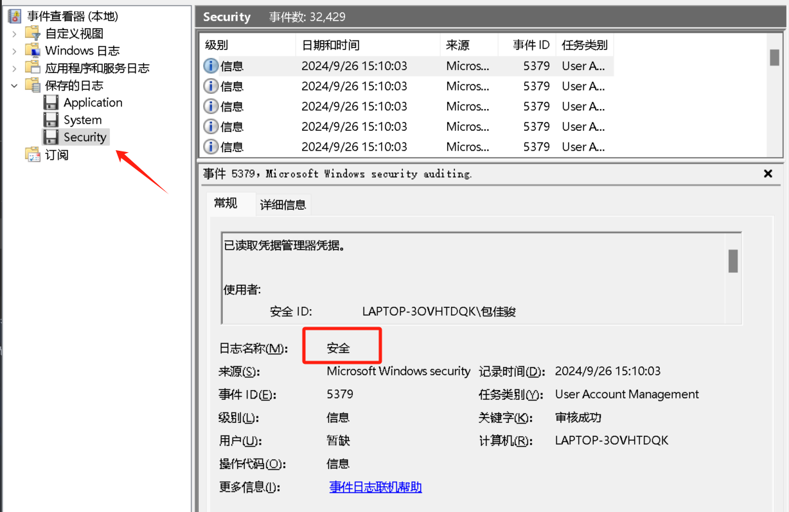

安全日志常用事件ID
|**EVENT ID**|**意义**|
|:--|:--|
|4624|表示**成功登陆**的用户，用来筛选该系统的用户登陆成功情况|
|4625|表示**登陆失败**的用户，用来判断RDP爆破的情况|
|4672|表示授予了**特殊权限**|
|4720,4722,4723,4724,4725,4726,4738,4740|事件ID表示当用户帐号发生创建，删除，改变密码时的事件记录。|
|4727,4737,4739,4762|表示当用户组发生添加、删除时或组内添加成员时生成该事件|

<mark>***设置Setup***</mark>

```
1,2,3,4，用来查看windows系统更新的记录，事件ID前后顺序为“已挂起、已安装、错误失败、提示重启” 。**事件ID3，更新错误或失败是重点查看对象**
```

## ***5、系统相关信息*** :pushpin:

- 系统版本、补丁信息

```
打开CMD，输入 systeminfo，查看系统信息
```

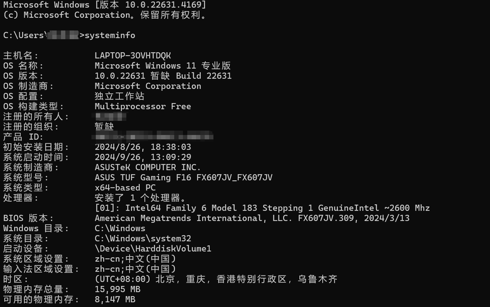

- 查找可疑目录或文件

```
1、 查看是否有新建用户目录，新建账号会在C:\Users生成一个用户目录
2、 分析可疑文件：C:\Users\Thinkpad\Recent
3、 回收站、浏览器下载目录、浏览器历史记录
4、 修改时间在创建时间之前的为可疑文件
```

- 发现 WebShell、远控木马的创建时间

```
如何找出同一时间范围内创建的文件
1、利用Registry Workshop注册表编辑器的搜索功能可以找到最后写入时间区间的文件  工具下载地址：https://www.torchsoft.com/en/rw_information.html
或者
2、利用计算机自带文件搜索功能，指定修改时间进行搜索
```

## ***6、各中间件/服务器日志默认存放位置*** :pushpin:

### **IIS**
```
C:\WINDOWS\system32\LogFiles
```

### **apache**<br>
apache默认日志在安装目录下的logs目录中
```
apache/logs/
```

### **tomcat**
```
ogs/catalina.xx.log logs/host-manager.xx.log logs/localhost.xx.log logs/manager.xx.log 主要记录系统启、关闭日志、管理日志和异常信息
```

### **weblogic**
```
domain_name/servers/server_name/logs/ server_name.log：server启停日志 access.log：安装在该server之上的应用http访问日志
```

### **jboss**
```
LOG4J配置默认Deploy/conf/ 如jboss/server/default/conf/jboss-log4j.xml
```

## ***7、工具进行查杀*** :pushpin:
1、卡巴斯基：http://devbuilds.kaspersky-labs.com/devbuilds/KVRT/latest/full/KVRT.exe<br>
2、火绒安全软件：https://www.huorong.cn<br>
3、D盾_Web查杀：http://www.d99net.net/index.asp<br>
4、Safe3：http://www.uusec.com/webshell.zip<br>