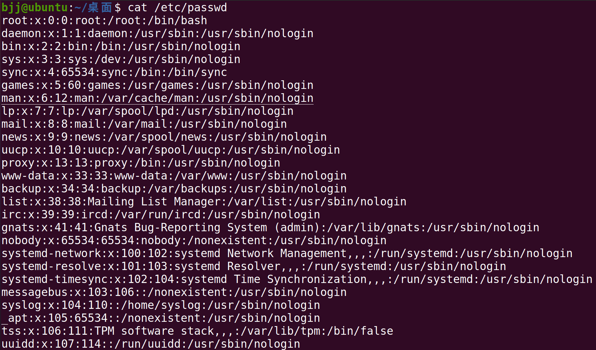
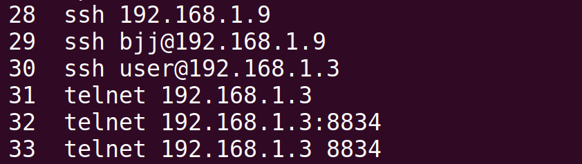
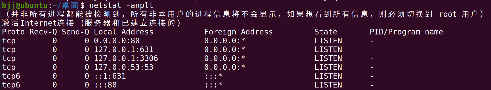
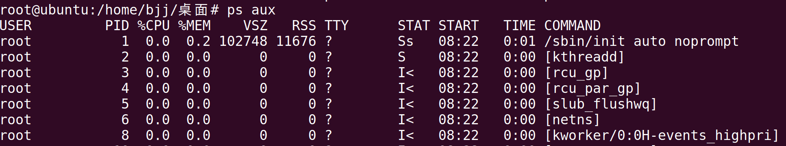
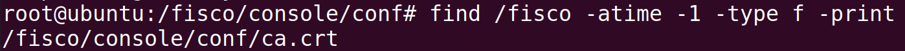
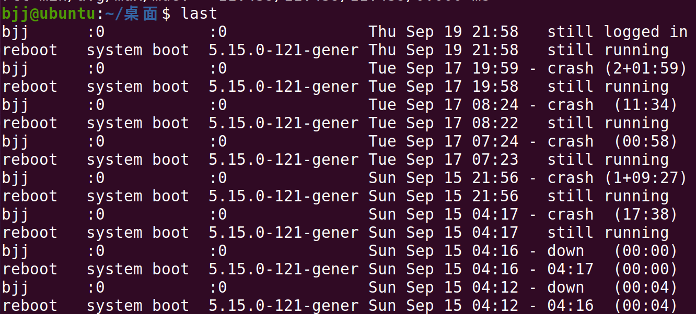
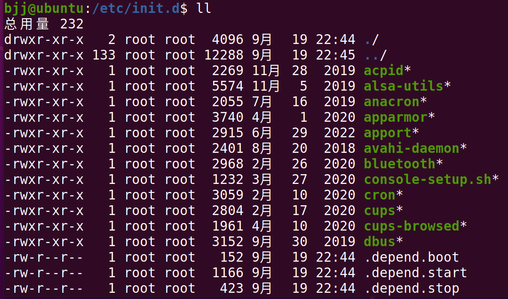
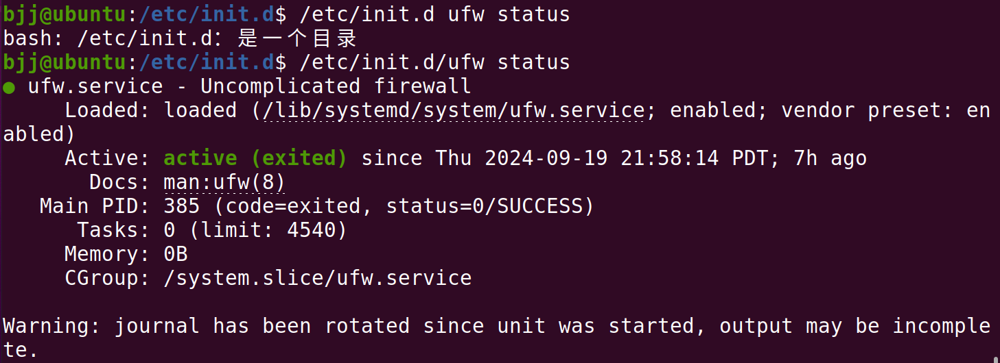
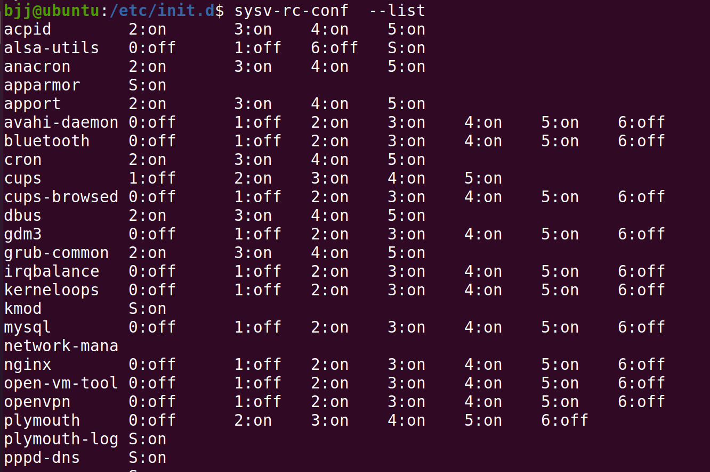

# ***应急响应操作手册（Linux篇）***</big>
# ***1、检查系统用户***

|**命令**|**说明**|
|:--|:--|
|cat/etc/passwd|查看是否有异常的系统用户|


>/etc/passwd 是一个文本文件，其中包含了登录 Linux 系统所必需的每个用户的信息。它保存用户的有用信息。<br>如<用户名：密码：用户 ID：群组 ID：用户 ID 信息：用户的根目录：Shell<br><br>
***1、用户名（root）***： 已创建用户的用户名，字符长度 1 个到 12 个字符。<br><br>
***2、密码（x）***：代表加密密码保存在 `/etc/shadow 文件中。<br><br>
***3、用户 ID（0）***：代表用户的 ID 号，每个用户都要有一个唯一的 ID 。UID 号为 0 的是为 root 用户保留的，UID 号 1 到 99 是为系统用户保留的，UID 号 100-999 是为系统账户和群组保留的。<br><br>
***4、群组 ID （0）***：代表群组的 ID 号，每个群组都要有一个唯一的 GID ，保存在 /etc/group文件中。<br><br>
***5、用户信息（root）***：代表描述字段，可以用来描述用户的信息（LCTT 译注：此处原文疑有误）。<br><br>
***6、根目录（/root）***：代表用户的家目录<br><br>
***7、Shell（/bin/bash）***：代表用户使用的 shell 类型。

|**命令**|**说明**|
|:--|:--|
|cat/etc/shadow|存储 Linux 系统中用户的密码信息，又称为“影子文件”|


>早期的 UNIX 密码放在 /etc/passwd 文件中，由于该文件允许所有用户读取，易导致用户密码泄露，因此将密码从 /etc/passwd 文件中分离出来，并单独放到了此文件中。/etc/shadow 文件只有 root 用户拥有读权限，保证了用户密码的安全性。如：用户名：加密密码：密码最后一次修改日期：两次密码的修改时间间隔：密码有效期：密码修改到期到的警告天数：密码过期之后的宽限天数：账号失效时间：保留

<mark>***哈希密码可以使用john进行破解***</mark>

***入侵排查其他常用命令***

|**命令**|**说明**|
|:--|:--|
|grep "0" /etc/passwd|查看是否产生了新用户，UID和GID为0的用户|
|ls -l /etc/passwd|查看passwd的修改时间，判断是否在不知的情况下添加用户|
|```awk -F: '$3==0 {print $1}' /etc/passwd```|查看是否存在特权用户|
|```awk -F: 'length($2)==0 {print $1}' /etc/shadow```|查看是否存在空口令帐户|
|more /etc/sudoers &#124; grep -v "^#&#124;^$" &#124; grep "ALL=(ALL)"|除root帐号外，其他帐号是否存在sudo权限|
|usermod -L user|禁用帐号，帐号无法登录，/etc/shadow第二栏为!开头|
|userdel user|删除user用户|
|userdel -r user|将删除user用户，并且将/home目录下的user目录一并删除|

# ***2、查看历史命令***
>linux系统默认会记录用户输入的命令，保存到一个.bash_history隐藏文件中，ls -al命令可以查看隐藏文件<br>

<mark>***history命令可以查看root用户的历史命令***</mark><br>


- 注意wget（有可能是下载木马文件），ssh（可能是异常连接内网主机），tar zip（数据打包），系统配置命令可能是修改系统相关配置
<br><br>如：登录ssh



- 在/home各账户目录下，cat /用户/.bash_history也可以查看普通用户的历史命令。<br><br>例如，查看用户 john 的历史记录：
```shell
cat /home/bjj/.bash_history
```

# ***3、检查异常端口***

|**命令**|**说明**|
|:--|:--|
|netstat -antlp|检查端口|
|ls -l /proc/$PID/exe|查看pid所对应的进程文件路径|



- 查看PID对应路径


- 使用telnet连接


# ***4、检查异常进程***

>使用ps命令结合aux，grep选项查看linux系统下的进程信息，还可以使用top命令查看是否有挖矿，木马病毒占用大量的系统资源

|**命令**|**说明**|
|:--|:--|
|ps aux &#124; grep pid|分析进程|
|ps -efe|查看进程|
|lsof -p pid|查看进程打开的端口和文件|




# ***5、计划任务排查***

>一般在linux下的任务计划文件是以cron开头的，linux系统中可以使用crontab命令进行计划任务的设置。
默认编写的crontab文件会保存在 （/var/spool/cron/用户名 例如:<mark>***/var/spool/cron/root***</mark>）

|***命令***|***说明***|
|:--|:--|
|crontab -l|列出某个用户cron服务的详细内容|
|crontab -r|删除每个用户cront任务(谨慎：删除所有的计划任务)|
|crontab -e|使用编辑器编辑当前的crontab文件|
|cat /etc/crontab|查看计划任务内容|
|ls /etc/cron.*|列出以cron.开头的文件或目录|
|more /etc/cron.daily/*|查看目录下所有文件|


向test.txt文件中写入计划任务
```shell
如：*/1 * * * * echo "hello world" >> /tmp/test.txt 每分钟写入文件  :每隔一分钟输出hello world
```

# ***6、异常文件检查***

>异常文件检查是排查黑客是否有修改服务器上的敏感目录或文件。<br>如/tmp目录下的文件，同时注意隐藏文件夹，以“..”为名的文件夹具有隐藏属性。
```shell
find / -uid 0 –perm -4000 –print
find / -size +10000k –print
find / -name "…" –print
find / -name ".." –print
find / -name "." –print
find / -name " " –print
```

<mark>***如：发现WEBSHELL、远控木马的创建时间，如何找出同一时间范围内创建的文件?***</mark>

```shell
find /opt -iname "*" -atime 1 -type f   //找出 /opt 下一天前访问过的文件
```



# ***7、检查系统日志***

>检查系统错误登陆日志，统计IP重试次数（last命令是查看系统登陆日志，比如系统被reboot或登陆情况）



|***日志文件***|***说明***|
|:--|:--|
|/var/log/|日志默认存放位置|
|more /etc/rsyslog.conf|查看日志配置情况|
|/var/log/cron|记录了系统定时任务相关的日志|
|/var/log/cups|记录打印信息的日志|
|/var/log/dmesg|记录了系统在开机时内核自检的信息，也可以使用dmesg命令直接查看内核自检信息|
|/var/log/mailog|记录邮件信息|
|/var/log/message|记录系统重要信息的日志。这个日志文件中会记录Linux系统的绝大多数重要信息，如果系统出现问题时，首先要检查的就应该是这个日志文件|
|/var/log/btmp|记录错误登录日志，这个文件是二进制文件，不能直接vi查看，而要使用lastb命令查看|
|/var/log/secure|记录验证和授权方面的信息，只要涉及账号和密码的程序都会记录，比如SSH登录，su切换|

# ***8、开机启动项***

>因为中毒会随系统的启动而启动的，所以一般会开机启动，检查一下启动的服务或者文件是否有异常，一般会在/etc/rc.local和crondtab -l 显示出来

<mark>***了解系统运行级别***</mark><br>

**查看运行级别用：runlevel**
|运行级别|含义|
|:--|:--|
|0|关机|
|1|单用户模式，root权限，用于系统维护，禁止远程登陆，就像Windows下的安全模式登录|
|2|多用户模式，没有NFS网络支持|
|3|完整的多用户文本模式，有NFS，登陆后进入控制台命令行模式|
|4|系统未使用，保留一般不用，在一些特殊情况下可以用它来做一些事情。例如在笔记本电脑的电池用尽时，可以切换到这个模式来做一些设置。|
|5|图形化模式，登陆后进入图形GUI模式或GNOME、KDE图形化界面，如X Window系统。|
|6|重启模式，默认运行级别不能设为6，否则不能正常启动，就会一直开机重启开机重启|

/etc/init.d/程序名 status命令可以查看每个程序的状态，排查启动项的目的是检查黑客在入侵服务器后是否有在启动项里安装后门程序。




在目录**/etc/rc.d/init.d**下有许多服务器脚本程序，一般称为服务(service)，当想要启动某个脚本时，只需要将可执行脚本丢在/etc/init.d目录下，然后在/etc/rc.d/rc*.d中建立软链接即可

# ***9、检查服务***
<mark>***查询已安装的服务***</mark>

```shell
chkconfig --list 查看服务自启动状态，可以看到所有的RPM包安装的服务

ps aux | grep crond 查看当前服务

系统在3与5级别下的启动项

中文环境

chkconfig --list | grep "3:启用\|5:启用"

英文环境

chkconfig --list | grep "3:on\|5:on"

Ubuntu可以使用sysv-rc-conf代替chkconfig

sysv-rc-conf  --list
```



# ***10、确保Linux系统安全***
>1、用户名和密码不能设置太简单<br><br>
2、不要使用默认的远程端口，避免被扫描到根据端口扫描，然后再进行密码扫描，默认的端口往往就是扫描器的对象。比如：22端口、6379端口等<br><br>
3、使用一些安全策略进行保护系统开放的端口使用iptables或者配置/etc/hosts.deny 和/etc/hosts.allow进行白名单设置
可以对/etc/passwd、/etc/group、/etc/sudoers、/etc/shadow等用户信息文件进行锁定<br><br>
4、禁ping 设置<br><br>
5、安装和使用防火墙、加密数据以及使用防病毒软件
