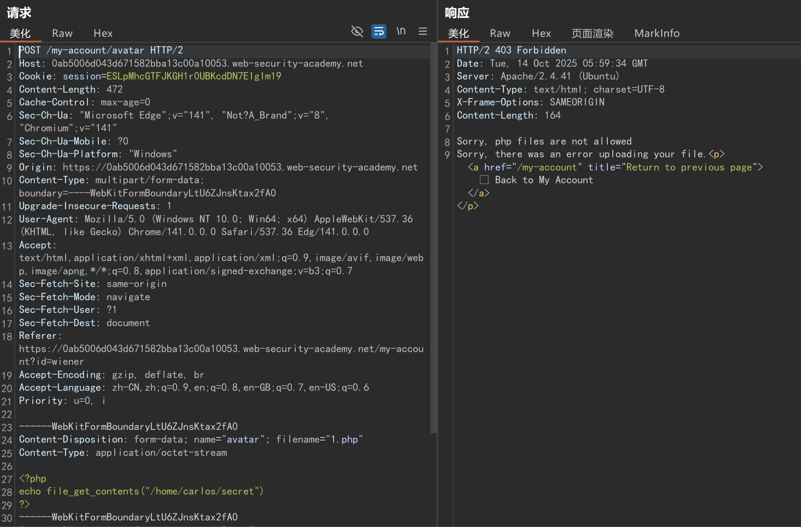
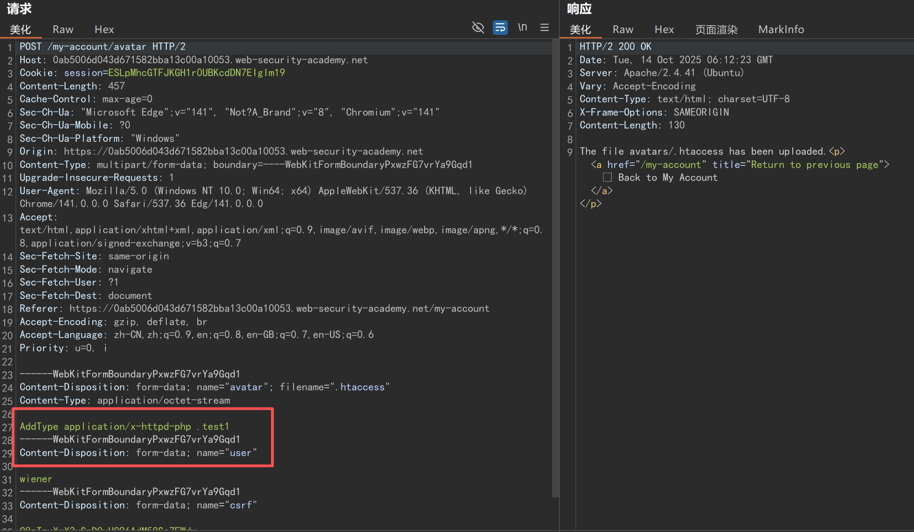
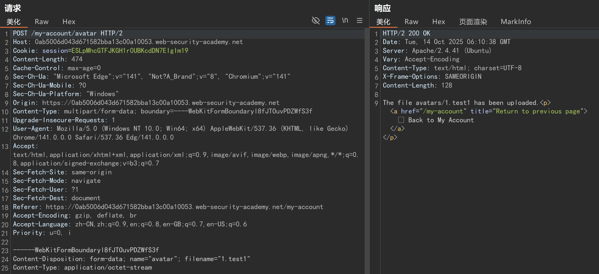
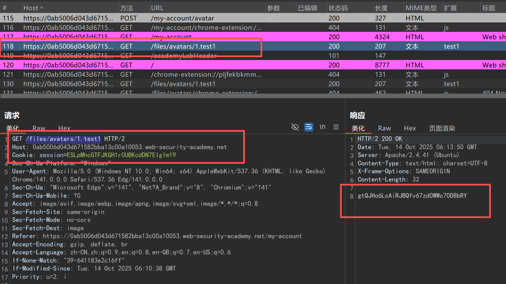

# 漏洞名称：Apache .htaccess 文件上传配置缺陷漏洞

# 漏洞核心成因
***该漏洞的本质是两个条件的叠加：***<br>
>**1、服务器对上传文件的文件名 / 类型验证不严格，允许攻击者上传.htaccess这类本应受限的配置文件；<br>
2、Apache 主配置中AllowOverride指令未严格限制（如设置为All或包含FileInfo权限），导致上传的.htaccess文件能生效，其配置指令（如AddType）被服务器执行，篡改了解析规则。**

# 漏洞复现
Apache 服务器中，.htaccess文件的核心作用是在特定目录（及子目录）中覆盖全局配置，允许管理员（或攻击者，若存在漏洞）在目录级别自定义服务器行为。其中，与文件解析相关的关键配置是 “扩展名与 MIME 类型 / 处理器的映射”。
默认情况下，Apache 通过AddType或AddHandler指令将.php扩展名映射到 PHP 处理器（application/x-httpd-php），例如：
```
AddType application/x-httpd-php .test1  # 告诉Apache：.test1文件用PHP模块处理
```
上传php/phtml被后端黑名单拦截



上传.htaccess文件将.test1文件映射为php文件处理



将php文件修改为.test1文件上传



访问上传的文件，成功运行php命令读取***home/carlos/secret***文件内容
```php
<?php 
echo file_get_contents("/home/carlos/secret")
?>
```



<big>***tips***:</big>
- **映射为 ASP 处理
ASP 通常需要 mod_isapi 模块支持（仅限 Windows 系统）。**<br><br>
&emsp;&emsp;&emsp;在 ***.htaccess*** 中添加以下规则：
```
AddHandler isapi-handler .asp
AddType application/x-httpd-asp .asp
```

- 映射为 JSP 处理
**JSP 需要 Tomcat 或 Resin 等 Servlet 容器支持。Apache 需通过 AJP 连接器与 Tomcat 通信。**<br><br>
&emsp;&emsp;&emsp;在 ***.htaccess*** 中配置（***按照实际tomcat端口修改***）：
```
ProxyPassMatch ^/(.*\.jsp)$ ajp://localhost:8009/$1
ProxyPassReverseMatch ^/(.*\.jsp)$ http://localhost:8080/$1
```

# 修复方法
**针对该漏洞，核心修复思路是禁止.htaccess文件的上传和生效，同时加强文件上传验证，具体措施如下：**
## 1. 严格禁止.htaccess文件上传
在文件上传的后端验证逻辑中，明确过滤文件名，直接拦截名为.htaccess的文件。<br><br>
&emsp;&emsp;&emsp;示例（PHP 后端）：
```php
$filename = $_FILES['file']['name'];
if ($filename === '.htaccess') {
    die('禁止上传.htaccess文件'); // 直接拦截
}
```
## 2. 限制AllowOverride权限（核心修复）
修改 Apache 主配置文件（如httpd.conf、apache2.conf），将AllowOverride设置为None，禁止目录级配置文件（.htaccess）生效。
<br><br>
&emsp;&emsp;&emsp;原危险配置（允许.htaccess生效）：
```
<Directory "/var/www/html">
    AllowOverride All  # 允许.htaccess覆盖所有配置（包括解析规则）
</Directory>
```
&emsp;&emsp;&emsp;修复后配置：
```
<Directory "/var/www/html">
    AllowOverride None  # 禁止.htaccess生效，忽略所有目录级配置文件
</Directory>
```
## 3. 加强文件上传的整体验证<br><br>
&emsp;&emsp;&emsp;
使用白名单机制：仅允许上传业务所需的安全扩展名（如.jpg、.png、.txt），拒绝所有未在白名单内的扩展名（包括.php、.htaccess、.php5等）。
验证文件内容：对上传文件进行内容校验（如图片文件检查文件头FFD8FF、89504E47等），避免 “伪装文件”（如包含 PHP 代码的图片马）。
限制上传目录的 PHP 解析权限：在 Apache 配置中，对上传目录（如/var/www/upload）单独设置禁止 PHP 解析，例如：
```
<Directory "/var/www/upload">
    php_flag engine off  # 禁止该目录下所有文件被PHP解析
</Directory>
```